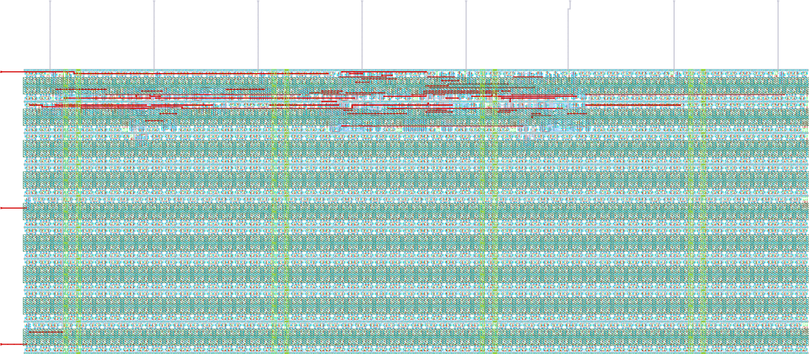

# ihp-sg13cmos5l Counter

<p align="center">
  <a href="render/img/counter_top_white.png">
    
  </a>
  <br>
  <em>Render of the ihp-sg13cmos5l counter layout (200um x 100um).</em>
</p>


## Directory Structure

<details>
<summary>Show Directory Structure</summary>

```text
📁 counter/
├─ 📁 final/
│  ├─ 📁 gds/
│  │  └─ counter_top.gds
│  ├─ 📁 lef/
│  │  └─ counter_top.lef
│  ├─ 📁 lib/
│  │  ├─ 📁 nom_fast_1p32V_m40C/
│  │  ├─ 📁 nom_fast_1p65V_m40C/
│  │  ├─ 📁 nom_slow_1p08V_125C/
│  │  ├─ 📁 nom_slow_1p35V_125C/
│  │  ├─ 📁 nom_typ_1p20V_25C/
│  │  └─ 📁 nom_typ_1p50V_25C/
│  ├─ 📁 nl/
│  │  └─ counter_top.nl.v
│  ├─ 📁 pnl/
│  │  └─ counter_top.pnl.v
│  ├─ 📁 spef/
│  │  └─ 📁 nom/
│  └─ 📁 vh/
│     └─ counter_top.vh
├─ 📁 flow/
│  ├─ 📁 final/               # .gitignore'd: important files are copied to counter/final/ (listed here to document LibreLane output folders)
│  │  ├─ 📁 def/              # Design Exchange Format: cell placement & routing (text-based)
│  │  ├─ 📁 gds/              # GDSII layout: final tape-out file
│  │  ├─ 📁 json_h/           # Yosys JSON headers: machine-readable netlist for internal scripts
│  │  ├─ 📁 klayout_gds/      # KLayout GDS: with extra visual-debug metadata
│  │  ├─ 📁 lef/              # Library Exchange Format: abstract pin & blockage view for P&R
│  │  ├─ 📁 lib/              # Liberty timing files: timing, power & area models
│  │  ├─ 📁 mag/              # Magic layout files: used for DRC & GDS generation
│  │  ├─ 📁 mag_gds/          # GDS generated/processed by Magic
│  │  ├─ 📁 nl/               # Netlist: gate-level Verilog after synthesis
│  │  ├─ 📁 odb/              # OpenDB: internal OpenROAD binary database (LEF+DEF combined)
│  │  ├─ 📁 pnl/              # Powered Netlist: gate-level Verilog with explicit VDD/VSS (for LVS)
│  │  ├─ 📁 render/           # Layout render images
│  │  ├─ 📁 sdc/              # Synopsys Design Constraints: clock periods & timing requirements
│  │  ├─ 📁 sdf/              # Standard Delay Format: timing delays for gate-level simulation
│  │  ├─ 📁 spef/             # Standard Parasitic Exchange Format: RC parasitics from layout
│  │  ├─ 📁 spice/            # SPICE netlist: for LVS & transistor-level simulation
│  │  ├─ 📁 vh/               # Verilog headers: for hierarchy management & simulation inclusion
│  │  ├─ metrics.csv          # Design metrics (area, power, timing slack, DRC/LVS): spreadsheet
│  │  └─ metrics.json         # Design metrics (area, power, timing slack, DRC/LVS): JSON summary
│  └─ 📁 librelane/
│     ├─ config.yaml
│     ├─ impl.sdc
│     ├─ pin_order.cfg
│     └─ signoff.sdc
├─ 📁 fpga/
│  ├─ 📁 arch/                # one fragment per FPGA architecture (ice40, ecp5)
│  ├─ 📁 icebreaker/          # per-board Makefile (device, programmer) and pin constraints
│  ├─ 📁 pico-ice/
│  ├─ 📁 ulx3s/
│  ├─ Makefile                # dispatcher, selects the board with BOARD=
│  ├─ dut.mk                  # RTL sources shared by all boards
│  ├─ fpga.mk                 # the shared flow
│  └─ README.md
├─ 📁 netlist/
│  ├─ 📁 nl/
│  │  └─ counter_top.nl.v
│  ├─ 📁 pnl/
│  │  └─ counter_top.pnl.v
│  ├─ 📁 spice/
│  │  └─ counter_top.spice
│  ├─ 📁 pex/
│  │  ├─ counter_top_klayout_pex_*.spice
│  │  └─ counter_top_magic_pex_*.spice
│  └─ 📁 xspice/
│     └─ counter_top.xspice
├─ 📁 render/
│  ├─ 📁 blender/
│  └─ 📁 img/
│     ├─ counter_top_black.png
│     ├─ counter_top_librelane.png
│     └─ counter_top_white.png
├─ 📁 rtl/
│  ├─ constants.sv
│  ├─ counter.sv
│  └─ counter_top.sv
├─ 📁 schematic/
│  └─ 📁 xschem/
│     ├─ counter_top.sym
│     ├─ counter_top_pex.sym
│     └─ xschemrc
├─ 📁 scripts/
│  ├─ check_pex_ports.py
│  ├─ spi2xspice.py
│  └─ verilog2sym.py
├─ 📁 testbenches/
│  ├─ 📁 cocotb/
│  │  ├─ counter_top_tb.gtkw
│  │  ├─ counter_top_tb.py
│  │  └─ counter_top_tb.surf.ron
│  ├─ 📁 verilog/
│  │  ├─ counter_top_tb.gtkw
│  │  ├─ counter_top_tb.surf.ron
│  │  └─ counter_top_tb.sv
│  └─ 📁 xschem/
│     ├─ 📁 plot_simulations/
│     │  ├─ 📁 data/
│     │  ├─ 📁 figures/
│     │  ├─ ngspice2python.py
│     │  └─ plot_counter_top.py
│     ├─ counter_top_tb_tran.sch
│     └─ xschemrc
├─ 📁 verification/
│  ├─ antenna_summary.rpt
│  ├─ antenna_violations.rpt
│  ├─ stapostpnr_summary.rpt
│  ├─ stapostpnr_nom_fast_1p32V_m40C_power.rpt
│  ├─ stapostpnr_nom_fast_1p65V_m40C_power.rpt
│  ├─ stapostpnr_nom_slow_1p08V_125C_power.rpt
│  ├─ stapostpnr_nom_slow_1p35V_125C_power.rpt
│  ├─ stapostpnr_nom_typ_1p20V_25C_power.rpt
│  ├─ stapostpnr_nom_typ_1p50V_25C_power.rpt
│  ├─ irdrop.rpt
│  ├─ drc.magic.rpt
│  ├─ drc.klayout.json
│  ├─ lvs.netgen.rpt
│  ├─ manufacturability.rpt
│  ├─ stat.rpt
│  ├─ yosys_post_dff.rpt
│  ├─ yosys_pre_techmap.rpt
│  └─ yosys_synth_check.rpt
├─ Makefile
└─ README.md
```

</details>


## Makefile Targets

### Show Available Targets

The default Make target is `help`, so running `make` prints usage and all available targets with short descriptions.

```sh
make
make help
```


### Open the Design Files

Opens a file browser for this folder with `sak-open.py` from the [IIC-OSIC-TOOLS](https://github.com/iic-jku/IIC-OSIC-TOOLS), one button per design file, grouped by directory:

```sh
make open
```

Clicking a button launches the matching tool in the file's own directory, so Xschem finds its `simulations/` folder and KLayout its run outputs where they belong:

| File type | Tool |
| --- | --- |
| `.sch`, `.sym` | Xschem |
| `.gds`, `.gds.gz`, `.oas`, `.oas.gz` | KLayout in edit mode |
| `.mag` | Magic |
| `.vcd`, `.fst`, `.gtkw` | GTKWave |
| `.raw` | gaw (ngspice rawfile) |
| `.png`, `.pdf` | the desktop's handler (`xdg-open`) |
| `.sv`, `.svh`, `.v`, `.vh`, `.vhd`, `.vhdl`, `.spice`, `.cir`, `.sp`, `.cdl`, `.sdc`, `.lef`, `.lib`, `.tcl`, `.mk`, `.yaml`, `.json`, `.py`, `.qmd`, `.tex`, `.md` and `Makefile` | gvim |

Only these types get a button. Files with any other extension (`.sh`, `.svg`, `.pcf`, `.save`, `.rpt`, `.txt`, `.csv` and so on) are not listed.

Schematics and symbols that belong to one design unit share a single tabbed Xschem instance instead of one process per click. The unit is the nearest ancestor holding a `Makefile`, so this macro gets its own instance and every tab writes its netlists to the folder this macro's `xschemrc` pins, see [Xschem Configuration](../../README.md#xschem-configuration).

The tree is rescanned every 15 s, so files a running flow produces appear on their own and are highlighted for a minute. Generated directories are skipped by default: `runs/`, `sim_build/`, `obj_dir/`, `simulations/`, `__pycache__/`, `_freeze/` and `.git/`. The Xschem `simulations/` folder is one of them, so the `.raw` files show up only with `--all`. Pass extra options with `OPEN_ARGS`:

```sh
make open OPEN_ARGS=--all              # include the build outputs
make open OPEN_ARGS="--prune backups"  # skip one more directory name
```

At most 400 buttons are drawn at once, because each one is an X window, and what is left out is stated at the end of the list. That cap is easy to hit with `--all`: it pulls in roughly 19000 files at the top level and 5700 in the counter, against 66 in the inverter. Use `--all` from the folder you actually care about, or narrow it with `--prune`, rather than at the top level.

> [!NOTE]
> This target needs a display. Run it inside the container's VNC/noVNC desktop or over X11 forwarding. In a shell-only container it stops with `cannot open a window`. The `.png` and `.pdf` buttons hand the file to the desktop's registered handler, so those two need the full VNC/noVNC session and do not work over a bare X forward.


### Linting

To lint the Verilog/SystemVerilog source files with [Verilator](https://www.veripool.org/verilator/), run:

```sh
make lint-verilog                # lint the full counter_top design
make lint-verilog CELL=counter   # lint the standalone counter cell
make lint-verilog-all            # lint counter and counter_top in sequence
```

When `CELL=counter_top` (the default), all synthesis sources (`constants.sv`, `counter.sv`, `counter_top.sv`) are passed to Verilator.
For a single cell, `constants.sv` is always included first so the shared `` `COUNTER_MAX_DEFAULT `` and `` `CLK_FREQ_DEFAULT `` macros are in scope.

[`rtl/constants.sv`](rtl/constants.sv) implements these constants as `` `define `` macros instead of a SystemVerilog package, because the Verilog frontend of Yosys 0.64 cannot parse `import pkg::*;` in a module header.
Macros have no scope, so the file has to be compiled **before** any module that references them.
That is why it is the first entry of `MODULES_SIM`, `_SIM_SRCS`, and `_LINT_SRCS` in the `Makefile`.

The `lint-verilog-all` target runs these lint checks in sequence:

1. `make lint-verilog CELL=counter`
2. `make lint-verilog` (default: `counter_top`)

This is also the lint step used by `make all`.


### Verification and Simulation

We use [cocotb](https://www.cocotb.org/), a Python-based testbench environment, and [Icarus Verilog](https://github.com/steveicarus/iverilog) for the verification of the macro.

The simulation targets are unified and accept an optional `CELL` variable (default: `counter_top`).
The waveform viewer can be changed with `WAVEFORM_VIEWER=<gtkwave|surfer>` (default: `gtkwave`).

> [!NOTE]
> In the current repository state, the provided Verilog, cocotb, and Xschem testbench/viewer files are for `counter_top`.
> Running simulation/view targets with another `CELL` requires corresponding testbench files (for example, `testbenches/verilog/<CELL>_tb.*`, `testbenches/cocotb/<CELL>_tb.py`, and `testbenches/xschem/<CELL>_tb_tran.sch`).

#### RTL Verilog Simulation

Compiles the RTL with Icarus Verilog and runs the simulation.
When `CELL=counter_top` (the default), the full `MODULES_SIM` source list is used and `testbenches/verilog/counter_top_tb.sv` is picked up.
For non-top cells, `constants.sv` is included first (so the shared `` `COUNTER_MAX_DEFAULT `` / `` `CLK_FREQ_DEFAULT `` macros are in scope), the RTL source is auto-selected as `rtl/<CELL>.sv` when present, otherwise `rtl/<CELL>.v`, and the testbench likewise as `testbenches/verilog/<CELL>_tb.sv` when present, otherwise `testbenches/verilog/<CELL>_tb.v`.
The waveform is written to `testbenches/verilog/` (e.g. `testbenches/verilog/counter_top_tb.vcd`):

```sh
make sim-rtl-verilog              # run counter_top RTL simulation
```

To view the waveform afterwards:

```sh
make sim-view-verilog                                  # view counter_top waveform
make sim-view-verilog WAVEFORM_VIEWER=surfer           # use Surfer instead
```

The simulation folder contains a pre-configured waveform layout file (`counter_top_tb.gtkw` for GTKWave, `counter_top_tb.surf.ron` for Surfer).
The view target loads it automatically together with the current `.vcd`, so signal formatting is preserved across runs.

#### RTL / GL cocotb Simulation

The cocotb testbench is located in `testbenches/cocotb/counter_top_tb.py` and exercises:

- reset clears the counter to 0
- the counter holds its value while `enable_i` is low
- the counter increments by 1 on every rising clock edge while `enable_i` is high
- the counter wraps from `CTR_MAX` back to 0

```sh
make sim-rtl-cocotb               # run counter_top RTL cocotb simulation
```

To run the gate-level (GL) cocotb simulation (sources the post-synthesis netlist from `final/nl/`):

```sh
make sim-gl-cocotb                # gate-level simulation of counter_top
```

> [!NOTE]
> Gate-level simulation requires the latest implementation in `flow/final/` (and a `final/nl/counter_top.nl.v` copy via `make copy-final`).

A waveform file is generated under `testbenches/cocotb/sim_build/counter_top.fst`.
To view it:

```sh
make sim-view-cocotb                                  # view counter_top waveform
make sim-view-cocotb WAVEFORM_VIEWER=surfer           # use Surfer instead
```

The cocotb folder contains a pre-configured waveform layout file (`counter_top_tb.gtkw` for GTKWave, `counter_top_tb.surf.ron` for Surfer).
The view target loads it automatically together with the current `.fst`, so signal formatting is preserved across runs.

#### Gate-Level Xschem Simulation

Runs the mixed-signal gate-level transient simulation testbench in `testbenches/xschem/<CELL>_tb_tran.sch`:

```sh
make sim-gl-xschem                # run counter_top gate-level Xschem simulation
make sim-gl-xschem CELL=<cell>    # run gate-level Xschem simulation for another cell
make sim-gl-xschem TB=<tb>        # run another testbench (default: <CELL>_tb_tran)
```

The testbench is selected with the `TB` variable, given without the `.sch` extension (default: `<CELL>_tb_tran`). All testbench schematics are located in `testbenches/xschem/`, and the generated netlists are written to `testbenches/xschem/simulations/`.

Every testbench pulls in a FET `.save` file through its `SAVE` code block (for example `.include counter_top_tb_tran.save`). That file lists the operating-point parameters of every transistor (`ids`, `gm`, `gds`, `vth` and so on), which the `annotate_fet_params` symbols and the `Annotate OP` launcher read back from the raw file. The include uses the bare file name, so it resolves inside `testbenches/xschem/simulations/`, where ngspice runs. Both `sim-gl-xschem` and the schematic's `Simulate` launcher write the file on every run, so it always matches the devices currently in the schematic and a fresh clone needs no manual export. Xschem's **IHP > Create FET .save file** menu entry writes the same file by hand.

The simulation runs in **batch mode**: the target netlists the testbench with `xschem netlist` and then invokes `ngspice -b` directly instead of using `xschem simulate`. `xschem simulate` would spawn an interactive ngspice in a terminal detached from `make`: the target would return immediately, the result would never be checked, and the process (with its X server) would leak. Running the simulator directly makes `make` block until the run finishes and see its exit status.

Because the run is headless, the `plot` commands in a testbench's `.control` block are a no-op and no plot windows appear. Every testbench instead exports its results with `wrdata` to `testbenches/xschem/plot_simulations/data/`, from where they are plotted with `sim-view-xschem`.

> [!NOTE]
> This flow expects the generated XSPICE model in `netlist/xspice/`. It is generated automatically by `make build-top` (right after `copy-netlist`), so it always matches the current LibreLane run. To regenerate it manually, run:
>
> ```sh
> make generate-xspice
> ```

#### View Xschem Simulation Results

After the gate-level Xschem simulation has completed, plot the results with the script selected by `SCRIPT`, given without the `.py` extension (default: `plot_<CELL>`):

```sh
make sim-view-xschem                      # run the default plotting script (plot_counter_top)
make sim-view-xschem SCRIPT=<scriptname>  # run another plotting script
```

The target runs `SHOW_PLOTS=1 python3 testbenches/xschem/plot_simulations/<SCRIPT>.py` and exports the figures and a CSV to `testbenches/xschem/plot_simulations/figures/`. Run through `sim-view-xschem`, the script additionally opens the plot windows when a display is available (e.g. the container's X/VNC session). Headless, only the figures are written.

> [!NOTE]
> `sim-view-xschem` is intentionally **not** called by `sim-all`. It opens an interactive plot window and must be called manually after the simulation has completed.

#### Run All Simulations

To run all simulation targets in sequence:

```sh
make sim-all
```

This executes the following targets in order:

1. `sim-rtl-verilog` (default: `counter_top`)
2. `sim-rtl-cocotb` (default: `counter_top`)
3. `sim-gl-cocotb` (default: `counter_top`)
4. `sim-gl-xschem` (default: `counter_top`)

> [!NOTE]
> The `sim-view-verilog` and `sim-view-cocotb` targets are intentionally **not** called by `sim-all`.
> Both open a waveform viewer GUI (GTKWave or Surfer), which blocks the shell until the window is closed.
> They are designed for interactive use and must be called manually after the simulation has completed.


### LibreLane Flow

Run the LibreLane flow with:

```sh
make librelane
```

Additional targets are available for different DRC configurations:

- `make librelane-nodrc` – run LibreLane without DRC checks
- `make librelane-magicdrc` – run LibreLane with only Magic DRC checks
- `make librelane-klayoutdrc` – run LibreLane with only KLayout DRC checks

After the LibreLane flow completes successfully, the generated views are saved under `flow/final/`. `flow/final/` is included in `.gitignore`.


### View the Design

After completion, you can view the design using the OpenROAD GUI:

```sh
make librelane-openroad
```

Or using KLayout:

```sh
make librelane-klayout
```


### Copy Important Reports

To copy the Yosys synthesis checks, antenna reports, post-PnR timing summary, per-corner power reports, IR-drop report, Magic/KLayout DRC results, LVS report, and manufacturability report from the latest run into `verification/`, run:

```sh
make copy-reports
```

This only works if at least one LibreLane run exists in `flow/librelane/runs/` and the latest run completed without errors.


### Copy the Final Folders

To copy the latest GDS, LEF, LIB, NL, PNL, SPEF, and VH from `flow/final/` into `final/`, run:

```sh
make copy-final
```

This assumes the final folders exist under `flow/final/` after a successful LibreLane run.


### Copy the Final Netlist

To copy the latest SPICE, PNL, and NL files from `flow/final/` into `netlist/`, run:

```sh
make copy-netlist
```

This only works if the required final views exist in `flow/final/spice/`, `flow/final/pnl/`, and `flow/final/nl/`.


### Copy the Final Render

To copy the latest LibreLane render from `flow/final/render/` into `render/img/`, run:

```sh
make copy-render
```

This only works if the final render exists in `flow/final/render/`.


### Render Top Layout

Renders the final GDS from `final/gds/` with `sak-render.py` from the [IIC-OSIC-TOOLS](https://github.com/iic-jku/IIC-OSIC-TOOLS) and saves the two images `counter_top_black.png` and `counter_top_white.png` (2048 px wide, 4x oversampling) in the `render/img/` folder:

```sh
make render-gds
```

This only works if the final GDS exists in `final/gds/`, so run `make copy-final` first.


### Build FPGA

Emulates the macro on an FPGA. The flow supports three boards across two FPGA architectures, and `counter_top` is synthesized directly onto board pins, without a board-top wrapper:

| Board | FPGA | Toolchain |
| --- | --- | --- |
| pico-ice (default) | Lattice iCE40UP5K | Yosys -> nextpnr-ice40 -> icepack |
| iCEBreaker | Lattice iCE40UP5K | Yosys -> nextpnr-ice40 -> icepack |
| ULX3S | Lattice ECP5-85F | Yosys -> nextpnr-ecp5 -> ecppack |

To run the full flow (clean -> lint -> synthesis -> place-and-route -> bitstream) on the default board, run:

```sh
make build-fpga
```

This invokes `make -C fpga all`. `fpga/Makefile` is a dispatcher that forwards to the selected board, so individual steps and other boards are reached from `fpga/`:

```sh
make -C fpga synthesis                  # Yosys synthesis for the default board
make -C fpga pr                         # nextpnr place-and-route
make -C fpga gen_bitstream              # bitstream
make -C fpga flash_bitstream            # write it to the board's flash
make -C fpga BOARD=ulx3s all            # the whole flow on another board
```

> [!NOTE]
> IIC-OSIC-TOOLS carries the build chain for all three boards, so the bitstreams build inside the container. Only programming the board needs the host, since the container has no USB access: build the bitstream inside, then run `load_bitstream`/`flash_bitstream` from the host (`dfu-util` for the pico-ice, `iceprog` for the iCEBreaker, `openFPGALoader` for the ULX3S). See [`fpga/README.md`](fpga/README.md) for the toolchain notes, the pin assignments, and how to add a further board.


### Build Top

To build the macro with LibreLane, copy its reports, copy final folders, copy netlists, generate the XSPICE model, copy the render, and render the final GDS, run:

```sh
make build-top
```


### Design Rule Check (DRC) & Layout Versus Schematic (LVS)

The LibreLane flow already includes DRC and LVS checks with Magic and KLayout, and they are saved in the `verification/` folder.


### Build the Xschem Symbol

The macro is hardened by LibreLane, so it has no schematic, and Xschem's own "make symbol from a schematic" (key `a`) has nothing to work from. `schematic/xschem/<CELL>.sym` is written by hand instead, and the rest of the gate-level flow bends to it: `sak-pin-reorder.py` sorts the ports of the XSPICE model and of the extracted PEX netlists into its pin order, matching them by the `sim_pinname` property of each pin.

That makes the symbol a source file, not a build product, which is why no target regenerates it during a build. The testbench schematics wire to pin **coordinates**, and a pin one grid step off its wire floats silently: Xschem gives the net an auto-generated name, the netlist stays valid, and the simulation runs and produces the wrong answer. A build that moved pins would introduce exactly that failure. The work is therefore split over two targets, one to scaffold a symbol that does not exist yet, one to check the one that does.

#### Scaffold a New Symbol

```sh
make symbol-gl                  # write schematic/xschem/counter_top.sym
make symbol-gl CELL=<cellname>  # scaffold the symbol of another cell
make symbol-gl FORCE=1          # overwrite an existing symbol
```

`symbol-gl` reads the ports of the powered netlist `netlist/pnl/<CELL>.pnl.v` and writes a first-cut symbol with [`scripts/verilog2sym.py`](scripts/verilog2sym.py). Every port becomes a pin carrying its direction, its bus range and its `sim_pinname`:

```text
B 5 -2.5 -82.5 2.5 -77.5 {name=VDD dir=inout sim_pinname=VDD}
B 5 -162.5 -42.5 -157.5 -37.5 {name=clock_i dir=in sim_pinname=clock_i}
B 5 157.5 -42.5 162.5 -37.5 {name=counter_value_o[0..7] dir=out sim_pinname=counter_value_o}
```

The powered netlist is the reference rather than the unpowered `netlist/nl/<CELL>.nl.v`, because it is the only one of the two that carries `VDD` and `VSS`, and rather than the RTL, because it is elaborated, so a bus is `[7:0]` instead of `[CTR_BW-1:0]`. Pointing the script at parameterised RTL is refused with that reason rather than guessed at. Both netlists come from `make copy-netlist`, so a new macro reaches its first symbol with `make build-top` followed by `make symbol-gl`.

The geometry follows Xschem's own symbol generator (`make_sym.awk`): inputs on the left edge, outputs and any remaining bidirectional ports on the right, 5x5 pin boxes on 20-unit stubs, and pin labels inside the body at text size 0.2. Two house rules are added on top. Supplies leave the body at the top and at the bottom instead of the sides, and the pin pitch is 40, so every pin lands on a multiple of 20 whatever the pin count. Loading a generated symbol into Xschem and saving it again returns it byte for byte, which is the cheapest evidence that it is written the way Xschem writes symbols itself.

The target refuses to overwrite an existing symbol unless `FORCE=1` is given, because the hand work lives in that file and there is no second copy of it.

What the scaffold gets right is the tedious part: the pin set, the directions, the bus ranges and the `sim_pinname` of every pin. What it cannot know is house style. For the counter, that is the whole of the difference between the scaffold and the committed symbol:

| | scaffold | committed `counter_top.sym` |
| --- | --- | --- |
| pin names | `clock_i`, `reset_n_i`, `enable_i`, `counter_value_o[0..7]` | `di_clock`, `di_reset_n`, `di_enable`, `do_b[0..7]` |
| pin order | netlist order, enable before reset | reset before enable |
| body | 280 x 120, pins on a 40 pitch | 160 x 160, pins on a 60 pitch |

Renaming the pins is safe because `sim_pinname` carries the binding to the netlist, which is what the property is for. Rename, arrange, redraw the body, then commit the result and treat it as a source file from then on.

#### Check the Symbol

```sh
make symbol-check                  # check counter_top.sym
make symbol-check CELL=<cellname>  # check the symbol of another cell
```

`symbol-check` compares the committed symbol against the same powered netlist and fails if it no longer describes the macro. It runs as the first step of `generate-xspice`, so every build that produces an XSPICE model has verified the symbol first, and a design that grew a port fails there instead of somewhere downstream.

`sak-pin-reorder.py` already refuses to reorder what it cannot map: it fails on a pin count mismatch, on a `sim_pinname` naming a port the netlist does not have, and on two pins claiming the same port. `symbol-check` adds the case it cannot see and two it has no data for:

- **A pin without `sim_pinname`.** This is the one that matters. A single pin missing the property switches `sak-pin-reorder.py` out of name matching for the whole symbol and into matching by position, which is correct only when the netlist keeps the symbol's port order. Magic sorts the ports of an extracted netlist alphabetically, so it does not. On this macro the fallback happens to abort, because the fixed power map it falls back to expects `a_VPWR` and `a_VGND` while the netlist has `a_VDD` and `a_VSS`. Take that accident away by naming the supplies anything else and the reorder exits 0 having mapped `enable_i` onto `counter_value_o[0]` and `counter_value_o[7]` onto `reset_n_i`. `symbol-check` makes the missing property itself the error, so the outcome no longer depends on what the supplies happen to be called.
- **A direction that disagrees with the netlist.** Nothing downstream reads `dir=`, because a SPICE instance line is positional, so an input drawn as an output survives the whole flow and misleads every reader of the symbol.
- **A port added to the RTL and forgotten in the symbol**, reported against the netlist before any conversion runs rather than as a pin count mismatch in the middle of one.

Every problem names the file, the line and the pin, and the target exits non-zero:

```text
[ERROR] schematic/xschem/counter_top.sym:19: pin 'di_clock' is dir=out, but 'clock_i' is an input port of module 'counter_top'.
[ERROR] schematic/xschem/counter_top.sym: module 'counter_top' has the port 'enable_i', but no pin declares sim_pinname=enable_i. Add the pin to the symbol.
```

The script can also be run by hand on any symbol and netlist pair:

```sh
python3 scripts/verilog2sym.py netlist/pnl/counter_top.pnl.v schematic/xschem/counter_top.sym --check
```


### Build Xschem PEX Symbol

Builds the Xschem symbol the PEX flow needs, `schematic/xschem/<CELL>_pex.sym`, from the regular cell symbol `schematic/xschem/<CELL>.sym`:

```sh
make symbol-pex                  # build counter_top_pex.sym from counter_top.sym
make symbol-pex CELL=<cellname>  # build the PEX symbol of another cell
```

The generated symbol is a verbatim copy of `<CELL>.sym` with a single change: `type=subcircuit` becomes `type=primitive`. `counter_top.sym` is already `type=primitive`, because its subcircuit comes from the included XSPICE model and Xschem must not descend into a schematic of that name, so here the copy differs from its source in nothing but the file name. What carries the meaning is the rest, which is inherited:

- **`format="@name @pinlist @symname"`** makes the instance reference `@symname`, which resolves to `<CELL>_pex`, exactly the `.subckt` name the PEX flow writes.
- **The pin order and the `sim_pinname` of every pin** are what `sak-pin-reorder.py` sorts the extracted netlist to, so they have to be the ones of the cell symbol. The symbol names its pins `di_clock`, `do_b[0]` and so on, the layout names them `clock_i`, `counter_value_o[0]`, and `sim_pinname` is what connects the two.

`symbol-pex` runs automatically at the start of `klayout-pex` and `magic-pex`, so the symbol is rebuilt from the current `<CELL>.sym` before every extraction and cannot go stale when a pin is added, removed or renamed. Calling it by hand is only needed to refresh the symbol without re-running an extraction. Anything added to the generated file by hand is lost at the next extraction, so make the change in `<CELL>.sym` instead.

> [!NOTE]
> Every symbol in this project also carries `spectre_format="@name ( @pinlist ) @symname"`. Xschem writes that line itself whenever a symbol is built from a schematic's pin list (key `a`, `make_sym.awk`), and it is read **only** by the Spectre netlister, which is also the one that drives VACASK (`xschem.tcl` configures `vacask "$N"` as the default simulator for `netlist_type spectre`). The SPICE netlister used for ngspice ignores it, so it has no effect on any target in this Makefile.
> Do not strip it: without it, instances of the symbol are **silently dropped** from a Spectre/VACASK netlist and the `subckt` line of the symbol itself comes out with an empty port list, with no warning at all.


### Parasitic Extraction (PEX)

Extracts the parasitics of the hardened macro from the final GDS and writes a post-layout SPICE netlist to `netlist/pex/`. It is the transistor-level counterpart of the gate-level XSPICE model, not a replacement for it:

| | `generate-xspice` | `magic-pex` / `klayout-pex` |
| --- | --- | --- |
| input | LibreLane's extracted `netlist/spice/<TOP>.spice` | the final layout `final/gds/<CELL>.gds` |
| standard cells | replaced by XSPICE primitives (`d_lut`, `d_dff`, ...) | flattened to transistors |
| parasitics | none, Liberty delays only | R and C from the layout |
| speed | fast, digital event driven | slow, full analog solve |

The extracted SPICE filenames include the selected extraction mode:
- `klayout-pex` writes `netlist/pex/<CELL>_klayout_pex_<EXT_MODE>.spice`
- `magic-pex` writes `netlist/pex/<CELL>_magic_pex_<EXT_MODE>.spice`

The `EXT_MODE` parameter selects the extraction mode:
- `1` = C-decoupled
- `2` = C-coupled
- `3` = full-RC (default)

**Magic PEX** uses `sak-pex.sh` (installed in the IIC-OSIC-TOOLS container):

```sh
make magic-pex
make magic-pex CELL=counter_top
make magic-pex CELL=counter_top EXT_MODE=1
```

**KLayout PEX** uses `kpex`, which runs Magic internally for the extraction itself:

> [!WARNING]
> `kpex` does not support the `ihp-sg13cmos5l` PDK yet, so the `klayout-pex` target currently fails. Use `magic-pex` for parasitic extraction until kpex gains CMOS5L support.

```sh
make klayout-pex
make klayout-pex CELL=counter_top EXT_MODE=1
```

> [!NOTE]
> For `klayout-pex`, `EXT_MODE=1` (C-decoupled) is not yet supported by kpex and automatically falls back to `EXT_MODE=2` (CC) with a warning.

Both targets read `final/gds/<CELL>.gds`, so **`make build-top` (or at least `make copy-final`) has to have run first**. They abort with a clear message if the GDS is missing, instead of failing somewhere inside the extractor. Unlike the analog macro there is no Xschem schematic to hand to kpex as the reference netlist, so `klayout-pex` passes the LibreLane-extracted `netlist/spice/<CELL>.spice` instead.

For full-RC extraction (`EXT_MODE=3`), `magic-pex` additionally exposes the three `extresist` tuning parameters of `sak-pex.sh`. They are ignored in `EXT_MODE=1`/`2`:

| Variable | `sak-pex.sh` option | Default | Meaning |
| --- | --- | --- | --- |
| `THRESHOLD` | `-t` | `10000` mOhm | only nets above this resistance are split into an RC network |
| `MINRES` | `-r` | `1000` mOhm | resistors below this value are merged away |
| `MINDELAY` | `-y` | `1` ps | nets with a smaller RC delay are not split (`0` = gate by resistance only) |

```sh
make magic-pex CELL=counter_top EXT_MODE=3 THRESHOLD=5000 MINRES=500 MINDELAY=2
```

The `.subckt` name in the extracted SPICE file is `<CELL>_pex`: `magic-pex` sets it directly via the `sak-pex.sh` option `-n <CELL>_pex`, while for `klayout-pex` it is automatically renamed from `<CELL>`, the name kpex writes.

Both targets start by running `symbol-pex` (see above), so `schematic/xschem/<CELL>_pex.sym` always reflects the current cell symbol. The `.subckt` pin order in the extracted SPICE file is then reordered with `sak-pin-reorder.py` (installed in the IIC-OSIC-TOOLS container) to match that symbol's pin positions, matching by `sim_pinname` because the symbol and the layout use different pin names. Both targets finish by running [`scripts/check_pex_ports.py`](scripts/check_pex_ports.py), which verifies that every pin of the `.subckt` really reaches the circuit and fails the target otherwise. It is the same check the analog macro runs, see [`macros/inverter/README.md`](../inverter/README.md) for the two cases it catches.

For `counter_top` the full-RC default extracts 4401 transistors into a 630 KB netlist and takes a few seconds. `klayout-pex` finds the same 4401 transistors and splits the RC network differently.

> [!NOTE]
> Magic's `extresist` step is not deterministic. Two `make magic-pex` runs on the same GDS give the same 4401 transistors, but the R and C counts move by around a percent (across four runs, 2079 to 2095 capacitors and 4609 to 4661 resistors), and the internal node names are renumbered. The committed `netlist/pex/counter_top_magic_pex_3.spice` therefore shows up as modified in `git status` after every run, even when nothing about the layout changed.

To run a **post-layout simulation**, open [`testbenches/xschem/counter_top_tb_tran.sch`](testbenches/xschem/counter_top_tb_tran.sch). It already `.include`s both the XSPICE model and `netlist/pex/counter_top_magic_pex_3.spice`, and above the testbench sit two spare instances, `x2` of `counter_top.sym` and `x3` of `counter_top_pex.sym`, both parked with `spice_ignore=true`. Swap the wired-up `x1` for the one you want. This is the same arrangement the analog testbenches use.

The testbench runs with `.options savecurrents klu method=gear reltol=1e-3 abstol=1e-12 gmin=1e-12 rshunt=1e14`. The looser tolerances and `rshunt` are what the extracted netlist needs. Full-RC extraction splits the nets into fragments, and some of the resulting nodes have no DC path to ground, so with the tighter settings the analog macro uses (`reltol=1e-4 abstol=1e-15 gmin=1e-15`) the post-layout run aborts at the initial timepoint with `Timestep too small; trouble with node ...`. The gate-level XSPICE run does not notice the change, its output is identical either way.

> [!WARNING]
> A post-layout run simulates every transistor of the macro in ngspice. In the IIC-OSIC-TOOLS container, 60 ns of transient take about 80 s, while the full 10 µs gate-level XSPICE run of the same testbench finishes in under 2 s. Use the XSPICE model for functional runs, and the PEX netlist on short, targeted stimuli to check timing and signal integrity.


### Lint, Build, Verify and Simulate All

Lints, builds, verifies and simulates the whole macro:

- `lint-verilog-all`
- `build-fpga`
- `build-top`
- `magic-pex`
- `sim-all`

Linting runs first to fail fast on structural RTL issues. The simulations run **after** the build, so the gate-level simulations (`sim-gl-cocotb`, `sim-gl-xschem`) run on the netlists and the XSPICE model produced by this build, not on those of a previous one. `magic-pex` sits between the two, so the post-layout netlist the Xschem testbench includes is extracted from the GDS of this build as well. `klayout-pex` is commented out in the recipe: it works (see [Parasitic Extraction (PEX)](#parasitic-extraction-pex)), but it is a second full extraction that nothing in the flow consumes. The DRC and LVS verification is done within the LibreLane flow.

```sh
make all
```


### Generate XSPICE File

To generate an XSPICE file of the macro for mixed-signal simulation in Xschem, run:

```sh
make generate-xspice
```

This builds the XSPICE model **directly from the LibreLane-extracted SPICE netlist** in `netlist/spice/<TOP>.spice` (copied from the last run by `make copy-netlist`). Three steps do the work:

1. `symbol-check` verifies that `schematic/xschem/<TOP>.sym` still describes the ports of the macro, see [Check the Symbol](#check-the-symbol). It runs first so that a symbol which no longer matches the design fails the target before anything is converted.
2. `spi2xspice.py` replaces every standard cell with an XSPICE primitive (`d_lut`, `d_dff`, …), taking the pin order from the inline black-box `.subckt` stubs in the extracted netlist and the logic functions from the Liberty file.
3. `sak-pin-reorder.py` (installed in the IIC-OSIC-TOOLS container) reorders the resulting `.subckt` ports to match the Xschem symbol in `schematic/xschem/<TOP>.sym`.

> [!NOTE]
> This target runs automatically as part of `make build-top` (right after `copy-netlist`), so the XSPICE model always matches the netlists of the current LibreLane run. The simulation timing parameters (`-io_time`, `-time`, `-idelay`, `-odelay`, `-cload`) are pinned in the Makefile, so regeneration is deterministic.
> Conversion pipeline: check the Xschem symbol → extracted SPICE (`.spice`) → XSPICE (`.xspice`) → reorder pins according to the Xschem symbol.

#### What You Must Consider

To get a working gate-level Xschem simulation from a LibreLane-generated netlist, two things must line up:

**1. Power nets must not collide with the testbench `.GLOBAL` nets.**
The extracted netlist names its supplies `VDD`/`VSS`, and the Xschem testbench declares `.GLOBAL VDD`. If the digital block exposed a node literally named `VDD`, ngspice would merge it with the analog global supply and abort with `singular matrix: check node auto_dac...`. `spi2xspice.py` avoids this by bridging every power (and otherwise unused) boundary net to a private `dig_<net>` node. Nothing is required from you here, but keep it in mind if you adapt the script or rename supplies.

**2. Symbol pins must declare their netlist name via `sim_pinname`.**
Magic sorts the top-level ports alphabetically, so their order in the extracted netlist does **not** match the symbol. `sak-pin-reorder.py` therefore maps pins **by name**: every pin in `schematic/xschem/<TOP>.sym` must carry a `sim_pinname=<netlist_name>` property, where the name is the RTL/netlist signal name, e.g.

```
B 5 ... {name=di_clock   dir=in    sim_pinname=clock_i}
B 5 ... {name=do_b[0..7] dir=out   sim_pinname=counter_value_o}
B 5 ... {name=VDD        dir=inout sim_pinname=VDD}
```

The script derives the XSPICE pin from that name (`clock_i` → `a_clock_i`, `counter_value_o[0]` → `a_counter_value_o_0_`) and matches by it, independent of port order. A bus `sim_pinname` may be given as a bare base (`counter_value_o`). The symbol bus indices are applied to it.

> [!NOTE]
> When you add a port to the design, add the matching pin to the symbol **and** give it a `sim_pinname` equal to the netlist signal name. `make symbol-check` verifies both on every build, and `sak-pin-reorder.py` aborts with a clear `expects XSPICE pin ... which is not in the .subckt` error for anything that reaches it.
> If any pin lacks `sim_pinname`, `sak-pin-reorder.py` falls back to positional matching (power by a fixed name-map, signals by position), which is only correct when the netlist keeps the symbol's port order (e.g. a Yosys `.nl.v` fed through `vlog2Verilog`). The Magic-extracted netlist used here never does, so `symbol-check` rejects a pin without `sim_pinname` outright rather than leaving the outcome to that fallback.

Then run the gate-level simulation as usual (see [Gate-Level Xschem Simulation](#gate-level-xschem-simulation)):

```sh
make sim-gl-xschem
```


### Clean

`make clean` deletes all generated files and folders. The sources stay untouched: the RTL, the schematics, symbols and testbenches, the scripts, the LibreLane and FPGA configurations, and `render/blender/`. Deleted are:

- `flow/librelane/runs/` and `flow/final/` (LibreLane run directories and the saved views)
- `final/` (GDS, LEF, Liberty, NL, PNL, SPEF and Verilog header deliverables)
- `netlist/` (NL, PNL, SPICE, XSPICE and the extracted PEX netlists)
- `render/img/` (the layout renders)
- `verification/` (the reports copied from the last LibreLane run)
- `schematic/xschem/simulations/`, `testbenches/xschem/simulations/` and the `plot_simulations/` outputs (`data/`, `figures/`, `__pycache__/`)
- `testbenches/cocotb/sim_build/`, the Icarus Verilog waveforms in `testbenches/verilog/`, and the `__pycache__` folders under `scripts/` and `testbenches/cocotb/`
- the FPGA outputs of every board (`fpga/<board>/build/`), by calling `make clean` in [`fpga/`](fpga/)

Every target recreates the folders it writes to, so a clean rebuild is:

```sh
make clean
make all
```

> [!WARNING]
> Most of these outputs are committed in this repository, so `make clean` leaves a large deletion set in `git status`. Run `git restore .` to get the tracked ones back if you did not mean to remove them. The LibreLane run directories under `flow/librelane/runs/` are **not** tracked and cannot be restored that way.

> [!NOTE]
> The Xschem testbench `.include`s both the XSPICE model `netlist/xspice/counter_top.xspice` and the extracted netlist `netlist/pex/counter_top_magic_pex_3.spice`, and the gate-level cocotb run needs the netlists in `netlist/`. Directly after `make clean`, run `make build-top` **and** `make magic-pex` (or the full `make all`, which does both) once before `make sim-gl-xschem` or `make sim-gl-cocotb`, otherwise the includes fail.


## Start a New Digital Macro from This Template

The counter is meant to be the starting point for a new digital macro. It already carries the full digital flow: SystemVerilog RTL, Verilator lint, Icarus Verilog and cocotb simulation, the LibreLane hardening flow with its SDC files and pin order, the XSPICE model generation for mixed-signal simulation in Xschem, and an FPGA emulation flow for three boards.

1. Copy the folder, for example to `macros/fifo`.
2. Run `make clean` in the new folder so that no output of the counter is left behind.
3. Set `TOP` in the `Makefile` and in every [`fpga/<board>/Makefile`](fpga/). Every target derives its paths from `TOP` (and from `CELL`, which defaults to `TOP`), so the design files must carry the same name.
4. Rename the RTL in `rtl/` and adjust `MODULES_SYNTH` and `MODULES_SIM` in the `Makefile` if you add or drop files.
5. Rename the testbenches in `testbenches/verilog/`, `testbenches/cocotb/` and `testbenches/xschem/`. Delete both symbols in `schematic/xschem/` rather than renaming them: renaming carries the counter's ports into the new macro, and `make symbol-check` rejects that on the first build. `make symbol-gl` scaffolds `<TOP>.sym` from the ports of the new design once it has been hardened (step 11), and `make symbol-pex` rebuilds `<TOP>_pex.sym` from it.
6. Update `flow/librelane/config.yaml`: `DESIGN_NAME`, `VERILOG_FILES`, `CLOCK_PORT` and `DIE_AREA`. Adapt the pin placement in `flow/librelane/pin_order.cfg` and the constraints in `impl.sdc` and `signoff.sdc`.
7. Update `DUT_SRCS` in `fpga/dut.mk`, and the pin constraint file in each `fpga/<board>/` you care about, to the ports of the new design. Delete the board folders you do not need, the dispatcher derives its board list from the folders that are there.
8. Rename the plotting script in `testbenches/xschem/plot_simulations/`.
9. Search and replace the remaining `counter` references inside the files, in particular the module instantiations, the `COUNTER_MAX_DEFAULT` and `CLK_FREQ_DEFAULT` macros in `rtl/constants.sv` (which keeps its name), the cocotb `hdl_toplevel` and source list, the two `.include` lines in the Xschem testbench (the XSPICE model and the extracted PEX netlist), and the raw file name in the plot script.
10. Register the macro at the chip top-level: add a `build-<name>` target and a `clean-all` entry in the top-level `Makefile`, instantiate the macro in `rtl/chip_core.sv` and `schematic/xschem/chip_top.sch`, and add a `MACROS` entry in `flow/librelane/config.yaml`.
11. Harden the macro once, then scaffold its Xschem symbol from the ports the hardening produced, arrange it, and only then run the full flow:

    ```sh
    make librelane        # harden the new design
    make copy-netlist     # brings netlist/pnl/<TOP>.pnl.v into the tree
    make symbol-gl        # scaffold schematic/xschem/<TOP>.sym from its ports
    xschem schematic/xschem/<TOP>.sym   # rename pins to house style, arrange, draw the body
    make all
    ```

    The symbol has to exist before `generate-xspice` runs, so a `make all` on a macro that has none stops there and says so. Wire the Xschem testbench to the finished symbol afterwards, because its pins are what the testbench connects to by coordinate.

For a new macro named `fifo`, the mechanical part looks as follows:

```sh
cp -r macros/counter macros/fifo
cd macros/fifo
make clean
# set TOP = fifo_top in the Makefile and in every fpga/<board>/Makefile, then:
rm -f schematic/xschem/counter*.sym
for f in rtl/counter* testbenches/verilog/counter* \
         testbenches/cocotb/counter* testbenches/xschem/counter* \
         testbenches/xschem/plot_simulations/plot_counter*; do
    mv "$f" "$(echo "$f" | sed 's/counter/fifo/')"
done
```

The remaining work is steps 6, 7, 9, 10 and 11, which all need real edits rather than renames.

> [!NOTE]
> The Xschem symbol `schematic/xschem/<TOP>.sym` must carry a `sim_pinname` property on every pin, see [Generate XSPICE File](#generate-xspice-file). `sak-pin-reorder.py` maps the ports of the extracted netlist onto the symbol by that name, and gate-level Xschem simulation breaks silently without it. `make symbol-gl` writes the property on every pin it scaffolds and `make symbol-check` refuses a symbol that is missing one, so neither the first symbol nor a later port change depends on remembering it.
