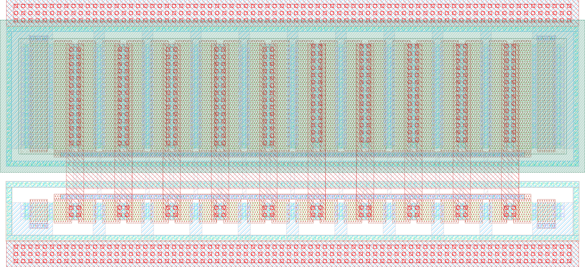

# ihp-sg13cmos5l Inverter

<p align="center">
  <a href="render/img/inverter_white.png">
    
  </a>
  <br>
  <em>Render of the ihp-sg13cmos5l inverter layout.</em>
</p>

This is the analog example **sub-macro** of the Chipalooza analog project template: the unit `inverter` cell with its complete flow (schematic → simulation → layout → DRC/LVS/PEX → post-layout simulation → characterization). The hand-drawn top level that embeds it, including the chip-level power straps and the PR boundary, lives one directory up in [`sg13cmos5l_cm_ip__single2diff2single`](../../README.md).

Everything here runs inside the [IIC-OSIC-TOOLS](https://github.com/iic-jku/IIC-OSIC-TOOLS) container, which ships every tool this macro needs: Xschem, ngspice, Magic, Netgen, KLayout, CACE, and the `sak-*` helper scripts.


## Directory Structure

<details>
<summary>Show Directory Structure</summary>

```text
📁 inverter/
├─ 📁 final/
│  ├─ 📁 gds/
│  │  └─ inverter.gds
│  ├─ 📁 lef/
│  │  └─ inverter.lef
│  ├─ 📁 lib/
│  │  └─ inverter.lib
│  └─ 📁 vh/
│     └─ inverter.vh
├─ 📁 layout/
│  └─ inverter.gds
├─ 📁 netlist/
│  ├─ 📁 layout/
│  │  ├─ *.cir                       # KLayout LVS extracted netlists
│  │  └─ *.ext.spc                   # Magic LVS extracted netlists
│  ├─ 📁 pex/
│  │  ├─ inverter_klayout_pex_*.spice
│  │  └─ inverter_magic_pex_*.spice
│  └─ 📁 schematic/
│     ├─ *.cdl                       # Xschem CDL netlists (KLayout LVS)
│     └─ *.spice                     # Xschem SPICE netlists (Magic + Netgen LVS)
├─ 📁 render/
│  └─ 📁 img/
│     ├─ inverter_black.png
│     └─ inverter_white.png
├─ 📁 schematic/
│  └─ 📁 xschem/
│     ├─ inverter.sch
│     ├─ inverter.sym
│     ├─ inverter_pex.sym
│     └─ xschemrc
├─ 📁 scripts/
│  ├─ 📁 sizing/
│  │  ├─ 📁 data/
│  │  ├─ 📁 figures/
│  │  ├─ lookup_commands.ipynb
│  │  └─ sizing_inverter.ipynb
│  └─ check_pex_ports.py
├─ 📁 testbenches/
│  └─ 📁 xschem/
│     ├─ 📁 plot_simulations/
│     │  ├─ 📁 data/
│     │  ├─ 📁 figures/
│     │  ├─ ngspice2python.py
│     │  └─ plot_inverter.py
│     ├─ inverter_tb_ac_ol.sch
│     ├─ inverter_tb_dc_vout.sch
│     ├─ inverter_tb_tran.sch
│     └─ xschemrc
├─ 📁 verification/
│  ├─ 📁 cace/
│  │  ├─ 📁 results/
│  │  ├─ 📁 scripts/
│  │  ├─ 📁 templates/
│  │  └─ inverter.yaml
│  ├─ 📁 drc/
│  │  ├─ 📁 inverter.klayout.drc/
│  │  └─ 📁 inverter.magic.drc/
│  └─ 📁 lvs/
│     ├─ 📁 inverter.klayout.lvs/
│     └─ 📁 inverter.magic.lvs/
├─ Makefile
└─ README.md
```

</details>


## Verification Scripts (`sak-*`)

The DRC, LVS, PEX, render and file-browser targets call the `sak-*` Swiss-Army-Knife scripts of the [IIC-OSIC-TOOLS](https://github.com/iic-jku/IIC-OSIC-TOOLS). They are pre-installed in the container and are on `PATH`, so the Makefile calls them by name and no copy is kept in this repository:

- `sak-drc.sh` — DRC with Magic or KLayout
- `sak-lvs.sh` — LVS with Magic + Netgen or KLayout
- `sak-pex.sh` — parasitic extraction with Magic
- `sak-pin-reorder.py` — reorders extracted `.subckt` pins to match an Xschem symbol
- `sak-render.py` — renders a layout GDS to PNG
- `sak-open.py` — the file browser behind `make open`

They read `PDK_ROOT`, `PDK`, `PDKPATH` and `STD_CELL_LIBRARY` from the environment. The container exports `PDK_ROOT`, and [`.designinit`](../../.designinit) in the repository root exports the other three, see [Verification Scripts](../../README.md#verification-scripts-sak-) in the top-level README.


## Makefile Targets

### Show Available Targets

The default Make target is `help`, so running `make` prints usage and all available targets with short descriptions.

```sh
make
make help
```

The `sim-xschem` target accepts an optional `TB=<testbenchname>` parameter (default: `<CELL>_tb_tran`), and `sim-view-xschem` an optional `SCRIPT=<scriptname>` parameter (default: `plot_<CELL>`).

All targets that operate on a specific cell accept an optional `CELL=<cellname>` parameter. The default is the top-level cell (`inverter`).

```sh
make <target> [CELL=<cellname>] [EXT_MODE=<1|2|3>] [THRESHOLD=<mOhm>] [MINRES=<mOhm>] [MINDELAY=<ps>] [DRC_LEVEL=<precheck|macro|regular>] [EV_PRECISION=<digits>] [TB=<testbenchname>] [SCRIPT=<scriptname>] [OPEN_ARGS=<options>]
```


### Open the Design Files

Opens a file browser for this folder with `sak-open.py` from the [IIC-OSIC-TOOLS](https://github.com/iic-jku/IIC-OSIC-TOOLS), one button per design file, grouped by directory:

```sh
make open
```

Clicking a button launches the matching tool in the file's own directory, so Xschem finds its `simulations/` folder and KLayout its run outputs where they belong:

| File type | Tool |
| --- | --- |
| `.sch`, `.sym` | Xschem |
| `.gds`, `.gds.gz`, `.oas`, `.oas.gz` | KLayout in edit mode |
| `.mag` | Magic |
| `.vcd`, `.fst`, `.gtkw` | GTKWave |
| `.raw` | gaw (ngspice rawfile) |
| `.png`, `.pdf` | the desktop's handler (`xdg-open`) |
| `.sv`, `.svh`, `.v`, `.vh`, `.vhd`, `.vhdl`, `.spice`, `.cir`, `.sp`, `.cdl`, `.sdc`, `.lef`, `.lib`, `.tcl`, `.mk`, `.yaml`, `.json`, `.py`, `.qmd`, `.tex`, `.md` and `Makefile` | gvim |

Only these types get a button. Files with any other extension (`.sh`, `.svg`, `.pcf`, `.save`, `.rpt`, `.txt`, `.csv` and so on) are not listed.

Schematics and symbols that belong to one design unit share a single tabbed Xschem instance instead of one process per click. The unit is the nearest ancestor holding a `Makefile`, so this macro gets its own instance and every tab writes its netlists to the folder this macro's `xschemrc` pins, see [Xschem Configuration](../../README.md#xschem-configuration).

The tree is rescanned every 15 s, so files a running flow produces appear on their own and are highlighted for a minute. Generated directories are skipped by default: `runs/`, `sim_build/`, `obj_dir/`, `simulations/`, `__pycache__/`, `_freeze/` and `.git/`. The Xschem `simulations/` folder is one of them, so the `.raw` files show up only with `--all`. Pass extra options with `OPEN_ARGS`:

```sh
make open OPEN_ARGS=--all              # include the build outputs
make open OPEN_ARGS="--prune backups"  # skip one more directory name
```

At most 400 buttons are drawn at once, because each one is an X window, and what is left out is stated at the end of the list.

> [!NOTE]
> This target needs a display. Run it inside the container's VNC/noVNC desktop or over X11 forwarding. In a shell-only container it stops with `cannot open a window`. The `.png` and `.pdf` buttons hand the file to the desktop's registered handler, so those two need the full VNC/noVNC session and do not work over a bare X forward.


### Layout File Extension Usage

The Makefile defines a `_GDS_EXT` variable that auto-selects the layout file extension: it prefers `.gds` when available, and falls back to `.klay.gds` otherwise. This macro ships only `layout/inverter.gds`, but a cell drawn in KLayout with live PCells and library references can be dropped in next to it as `<name>.klay.gds` and every sign-off target picks it up, see [Layout Sources and the Exported Tapeout GDS](../../README.md#layout-sources-and-the-exported-tapeout-gds) in the top-level README.

- Targets that use `layout/<name>.$(_GDS_EXT)` and work with either `.gds` or `.klay.gds` (the `sak` scripts derive the GDS top cell name from the `<name>.klay.gds` naming convention):
  - `klayout-lvs`
  - `klayout-drc`
  - `klayout-pex`
  - `magic-lvs`
  - `magic-drc`
  - `magic-pex`

- Build targets always use `layout/<name>.gds`:
  - `lef`
  - `copy-gds`
  - `render-gds`


### Run Xschem Testbench Simulation

Runs a single Xschem testbench in batch mode (no display): saves the schematic, exports the netlist to `testbenches/xschem/simulations/`, and runs the simulator.

The target netlists the testbench with `xschem netlist` and then invokes `ngspice -b` directly instead of using `xschem simulate`. `xschem simulate` would spawn an interactive ngspice in a terminal detached from `make`: the target would return immediately, the result would never be checked, and the process (with its X server) would leak. Running the simulator directly makes `make` block until the run finishes and see its exit status.

Because the run is headless, the `plot` commands in a testbench's `.control` block are a no-op and no plot windows appear. Every testbench instead exports its results with `wrdata` to `testbenches/xschem/plot_simulations/data/`, from where they are plotted with `sim-view-xschem`.

The testbench is selected with the `TB` variable, given without the `.sch` extension (default: `<CELL>_tb_tran`):

```sh
make sim-xschem                     # run the default testbench (inverter_tb_tran)
make sim-xschem TB=<testbenchname>  # run another testbench
```

For example:

```sh
make sim-xschem TB=inverter_tb_ac_ol
make sim-xschem TB=inverter_tb_tran
make sim-xschem TB=inverter_tb_dc_vout
```

All available testbench schematics are located in `testbenches/xschem/`. Generated netlists are written to `testbenches/xschem/simulations/`.

Every testbench pulls in a FET `.save` file through its `SAVE` code block (for example `.include inverter_tb_ac_ol.save`). That file lists the operating-point parameters of every transistor (`ids`, `gm`, `gds`, `vth` and so on), which the `annotate_fet_params` symbols and the `Annotate OP` launcher read back from the raw file. The include uses the bare file name, so it resolves inside `testbenches/xschem/simulations/`, where ngspice runs. Both `sim-xschem` and the schematic's `Simulate` launcher write the file on every run, so it always matches the devices currently in the schematic and a fresh clone needs no manual export. Xschem's **IHP > Create FET .save file** menu entry writes the same file by hand.


### Plot Xschem Simulation Results

Plots simulation results using the Python script selected by `SCRIPT`, given without the `.py` extension (default: `plot_<CELL>`):

```sh
make sim-view-xschem                      # run the default plotting script (plot_inverter)
make sim-view-xschem SCRIPT=<scriptname>  # run another plotting script
```

The target runs `SHOW_PLOTS=1 python3 testbenches/xschem/plot_simulations/<SCRIPT>.py`. Every script writes its figures to `testbenches/xschem/plot_simulations/figures/`. The interactive plot windows only open when `SHOW_PLOTS` is set (the target sets it) and a display is available, e.g. the container's VNC/X11 session. Running a script directly without it is fully headless and just writes the figures.

Examples:

```sh
make sim-view-xschem SCRIPT=plot_inverter
```


### CACE Simulations

Runs [CACE](https://github.com/fossi-foundation/cace) characterization for the inverter macro using `verification/cace/inverter.yaml`. CACE is part of the IIC-OSIC-TOOLS container.

The `sim-cace` target runs these parameter sets in sequence:
- `ac_mm_params`
- `ac_mc_params`
- `ac_params`

For each run, selected result plots are copied to `verification/cace/results/inverter/`, and temporary `_runs` folders are cleaned between runs. At the end, `_runs`, `_docs`, and `netlist` under `verification/cace/` are removed.

Run with:

```sh
make sim-cace
```

Result plots are saved to:
- `verification/cace/results/inverter/`
  - `Adc_ol_dB_mm.png`, `fcu_mm.png`
  - `Adc_ol_dB_mc.png`, `fcu_mc.png`
  - `Adc_ol_dB_vs_vdd.png`, `fcu_vs_vdd.png`

> [!NOTE]
> The result callback in `verification/cace/scripts/inverter_tb_ac.py` must not `print()`. CACE 2.11.0 redirects stdout into its rich logger while the script runs and the logger writes back to stdout, so any print from that hook recurses without end.


### Simulate All

Runs all simulation steps in sequence:
- `make sim-xschem TB=inverter_tb_ac_ol`
- `make sim-xschem TB=inverter_tb_tran`
- `make sim-xschem TB=inverter_tb_dc_vout`
- `make sim-cace`

Invoke with:

```sh
make sim-all
```

> [!NOTE]
> The `sim-view-xschem` target is intentionally **not** called by `sim-all`.
> It opens the generated Python figures, which blocks the shell until the window is closed.
> They are designed for interactive use and must be called manually after the simulation has completed.


### Build Top Cell

Builds the top-level cell deliverables in sequence: LEF export, LIB generation, Verilog stub generation, GDS copy, and layout image rendering:

```sh
make build-top
```

> [!NOTE]
> Unlike the [top level](../../README.md#pr-boundary-check), this macro has no `check-boundary` step. The PR boundary box on layer 189 is only needed by the cell the chip flow places, which is `sg13cmos5l_cm_ip__single2diff2single`, not the `inverter` cells inside it.


### Export LEF

Exports a LEF file (`final/lef/<TOP>.lef`) from the top-level layout GDS in `layout/` using Magic with the `-hide` option:

```sh
make lef
```

`-hide` writes one `PORT` per labelled pin rectangle (`<Metal>.pin`, datatype 2) and turns the rest of the macro into obstruction. Draw the pin rectangles of a supply net so that they do not overlap on one layer: rectangles that merge into an L shape are dropped from the LEF without a warning, and a placing flow then cannot connect the net.


### Liberty Timing Library

Generates a Liberty timing library stub (`final/lib/<TOP>.lib`) with default threshold settings for the top-level cell:

```sh
make lib
```


### Verilog Stub

Generates a Verilog stub (`final/vh/<TOP>.vh`) for top-level integration by parsing pins from an extracted PEX netlist in `netlist/pex/`.

The `verilog` target:
- requires one of the following PEX files (run `make magic-pex` or `make klayout-pex` first):
  - `netlist/pex/<TOP>_magic_pex_1.spice`
  - `netlist/pex/<TOP>_magic_pex_2.spice`
  - `netlist/pex/<TOP>_magic_pex_3.spice`
  - `netlist/pex/<TOP>_klayout_pex_1.spice`
  - `netlist/pex/<TOP>_klayout_pex_2.spice`
  - `netlist/pex/<TOP>_klayout_pex_3.spice`
- auto-selects the first existing file from the list above
- reads the `.subckt <TOP>_pex` pin list (including continuation lines)
- emits recognized supply pins (`VDD`, `VSS`, `VPWR`, `VDPWR`, `VAPWR`, `VGND`, `VNB`, `VPB`) as `inout` under `` `ifdef USE_POWER_PINS ``
- classifies signal pins by prefix: `di_*` as `input`, `do_*` as `output`, others as `inout`
- collapses indexed pins (`name[i]`) into vector ports (e.g. `inout [7:0] ui_in`)

```sh
make verilog
```


### Copy GDS

Copies the top-level GDS from `layout/` to `final/gds/`:

```sh
make copy-gds
```


### Render Layout Image

Renders the top-level layout GDS with `sak-render.py` from the [IIC-OSIC-TOOLS](https://github.com/iic-jku/IIC-OSIC-TOOLS) and saves the two images `inverter_black.png` and `inverter_white.png` (2048 px wide, 4x oversampling) in `render/img/`:

```sh
make render-gds
```


### Design Rule Check (DRC)

Runs DRC on the layout in `layout/`. Both flows use `sak-drc.sh`.

- `klayout-drc` and `magic-drc` use `layout/<CELL>.$(_GDS_EXT)` (`.gds` if present, otherwise `.klay.gds`)

Reports are written into per-cell run folders: `verification/drc/<CELL>.magic.drc/` (Magic) and `verification/drc/<CELL>.klayout.drc/` (KLayout, `.lyrdb`). The run folders are wiped at the start of each run, so they always reflect the latest run only.

The `DRC_LEVEL` parameter selects the KLayout DRC level (`sak-drc.sh -l`). It is ignored by `magic-drc`, since Magic has no selectable rule decks and always runs the full rule set compiled into the PDK's Magic tech file:

- `precheck` = core FEOL + BEOL manufacturing rules only (fast iteration)
- `macro` = block-in-isolation sign-off: `precheck` plus off-grid, zero-area, and pin/label checks (default)
- `regular` = full-chip sign-off: all checks, including density and antenna

| Check | `precheck` | `macro` _(default)_ | `regular` |
| --- | :---: | :---: | :---: |
| FEOL + BEOL core rules | ✓ | ✓ | ✓ |
| Off-grid / angle | – | ✓ | ✓ |
| Zero-area / geometry | – | ✓ | ✓ |
| Pin / label | – | ✓ | ✓ |
| Recommended / extra rules | – | – | ✓ |
| Density (chip-level fill) | – | – | ✓ |
| Antenna | – | – | ✓ |

**KLayout DRC** runs a KLayout DRC at the selected `DRC_LEVEL`:

```sh
make klayout-drc
make klayout-drc CELL=inverter
make klayout-drc CELL=inverter DRC_LEVEL=regular
```

**Magic DRC** runs a Magic DRC with all subcells flattened (`sak-drc.sh -f "*"`):

```sh
make magic-drc
make magic-drc CELL=inverter
```


### Export Schematic Netlist for LVS

Exports the schematic netlist for LVS from Xschem and places it in `netlist/schematic/`.

The `EV_PRECISION` parameter sets the number of significant digits used by Xschem's `ev` function when calculating device properties (default: 5). Increase this to avoid LVS mismatches caused by floating-point rounding differences between Xschem and KLayout (see [xschem#465](https://github.com/StefanSchippers/xschem/issues/465)).

The `ntap` and `ptap` substrate contacts are ignored during LVS in both flows. `sak-lvs.sh` runs KLayout LVS with the `--disable_tap_extraction` option so it does not extract `ntap` and `ptap` devices from the layout (matching Magic + Netgen LVS).

KLayout uses CDL netlists, while Magic uses SPICE netlists. Accordingly, `klayout-lvs-netlist` uses the Xschem commands `set spiceprefix 1`, `set lvs_netlist 1`, `set top_is_subckt 1`, and `set lvs_ignore 1`, while `magic-lvs-netlist` uses `set spiceprefix 1`, `set lvs_netlist 0`, `set top_is_subckt 1`, and `set lvs_ignore 1`. Hence, switching between CDL and SPICE netlists can be done with `lvs_netlist`.

To extract a CDL schematic netlist for KLayout LVS, use:
```sh
make klayout-lvs-netlist
make klayout-lvs-netlist CELL=inverter
make klayout-lvs-netlist EV_PRECISION=5
```

To extract a SPICE schematic netlist for Magic + Netgen LVS, use:
```sh
make magic-lvs-netlist
make magic-lvs-netlist CELL=inverter
make magic-lvs-netlist EV_PRECISION=5
```


### Layout Versus Schematic (LVS)

Exports the schematic netlist from Xschem, then runs LVS. Compares the layout in `layout/` against the schematic netlist in `netlist/schematic/`.

- `klayout-lvs` and `magic-lvs` use `layout/<CELL>.$(_GDS_EXT)` (`.gds` if present, otherwise `.klay.gds`)

Both flows use `sak-lvs.sh` and write their reports into per-cell run folders: `verification/lvs/<CELL>.magic.lvs/` (Magic + Netgen) and `verification/lvs/<CELL>.klayout.lvs/` (KLayout, `.lvsdb`). The run folders are wiped at the start of each run, so they always reflect the latest run only. The extracted layout netlist is moved to `netlist/layout/`.

**KLayout LVS** uses `sak-lvs.sh` (KLayout mode `-k`), which wraps `run_lvs.py` from the IHP Open-PDK:

```sh
make klayout-lvs
make klayout-lvs CELL=inverter
```

**Magic + Netgen LVS** uses `sak-lvs.sh` (Magic + Netgen mode, the default), which extracts the layout netlist with Magic and compares it against the schematic netlist with Netgen, using the Netgen setup from the IHP Open-PDK:

```sh
make magic-lvs
make magic-lvs CELL=inverter
```


### Build Xschem PEX Symbol

Builds the Xschem symbol the PEX flow needs, `schematic/xschem/<CELL>_pex.sym`, from the regular cell symbol `schematic/xschem/<CELL>.sym`:

```sh
make symbol-pex                  # build inverter_pex.sym from inverter.sym
make symbol-pex CELL=<cellname>  # build the PEX symbol of another cell
```

The generated symbol is a verbatim copy of `<CELL>.sym` with a single change: `type=subcircuit` becomes `type=primitive`. Everything else (pin boxes and their order, `format`, `spectre_format`, `template`, graphics) is inherited, which is exactly what the PEX flow needs:

- **`type=primitive`** stops Xschem from descending into a schematic of the same name. There is no `<CELL>_pex.sch`, so the instance line is emitted as it stands and the subcircuit comes from the `.include`d PEX netlist instead.
- **`format="@name @pinlist @symname"`** makes the instance reference `@symname`, which resolves to `<CELL>_pex`, exactly the `.subckt` name the PEX flow writes.
- **The pin order** is what `sak-pin-reorder.py` reorders the extracted netlist to, so it has to be the one of the cell symbol.

`symbol-pex` runs automatically at the start of `klayout-pex` and `magic-pex`, so the symbol is rebuilt from the current `<CELL>.sym` before every extraction and cannot go stale when a pin is added, removed or renamed. Calling it by hand is only needed to refresh the symbol without re-running an extraction. Anything added to the generated file by hand is lost at the next extraction, so make the change in `<CELL>.sym` instead.

If `<CELL>.sym` does not exist, the target prints a note and does nothing, which leaves the PEX targets running without a pin reorder just as before. It fails only when `<CELL>.sym` declares neither `type=subcircuit` nor `type=primitive`.

> [!NOTE]
> Every symbol in this project also carries `spectre_format="@name ( @pinlist ) @symname"`. Xschem writes that line itself whenever a symbol is built from a schematic's pin list (key `a`, `make_sym.awk`), and it is read **only** by the Spectre netlister, which is also the one that drives VACASK (`xschem.tcl` configures `vacask "$N"` as the default simulator for `netlist_type spectre`). The SPICE netlister used for ngspice ignores it, so it has no effect on any target in this Makefile.
> Do not strip it: without it, instances of the symbol are **silently dropped** from a Spectre/VACASK netlist and the `subckt` line of the symbol itself comes out with an empty port list, with no warning at all.


### Parasitic Extraction (PEX)

Runs parasitic extraction on the layout in `layout/`. The extracted SPICE netlist is written to `netlist/pex/`.

- `klayout-pex` and `magic-pex` use `layout/<CELL>.$(_GDS_EXT)` (`.gds` if present, otherwise `.klay.gds`)

The extracted SPICE filenames include the selected extraction mode:
- `klayout-pex` writes `netlist/pex/<CELL>_klayout_pex_<EXT_MODE>.spice`
- `magic-pex` writes `netlist/pex/<CELL>_magic_pex_<EXT_MODE>.spice`

The `EXT_MODE` parameter selects the extraction mode:
- `1` = C-decoupled
- `2` = C-coupled
- `3` = full-RC (default)

> [!NOTE]
> For `klayout-pex`, `EXT_MODE=1` (C-decoupled) is not yet supported by kpex and automatically falls back to `EXT_MODE=2` (CC) with a warning.

The `.subckt` name in the extracted SPICE file is `<CELL>_pex`: `magic-pex` sets it directly via the `sak-pex.sh` option `-n <CELL>_pex`, while for `klayout-pex` it is automatically renamed from `<CELL>` (kpex).

Both targets start by running `symbol-pex` (see above), so `schematic/xschem/<CELL>_pex.sym` always reflects the current cell symbol. The `.subckt` pin order in the extracted SPICE file is then reordered with `sak-pin-reorder.py` (installed in the IIC-OSIC-TOOLS container) to match that symbol's pin positions. This ensures the PEX netlist can be used directly with the corresponding Xschem symbol for simulation regardless of the selected `EXT_MODE`.

Both targets finish by running [`scripts/check_pex_ports.py`](scripts/check_pex_ports.py) on the netlist they just wrote. It verifies that every pin of the `.subckt` really reaches the circuit, and fails the target otherwise. Two cases are caught:

- A port that is declared in the `.subckt` line but referenced by no element at all. Whatever is wired to that pin from outside is then left floating.
- A port whose net was split into `<port>.t<n>` and `<port>.n<n>` fragments by `extresist` (`EXT_MODE=3`), where none of the fragments is connected back to the port. The pin is then dangling even though the fragments themselves are wired up.

Both produce a netlist that ngspice reads without a single warning while the cell behaves completely differently in simulation, so the check is worth the two seconds it costs. It can also be run by hand on any SPICE netlist:

```sh
python3 scripts/check_pex_ports.py netlist/pex/inverter_magic_pex_2.spice
python3 scripts/check_pex_ports.py -v netlist/pex/*.spice     # -v also prints the size of each subcircuit
```

**KLayout PEX** uses `kpex` with the Magic extraction engine currently (2.5D engine is work in progress):

> [!WARNING]
> `kpex` does not support the `ihp-sg13cmos5l` PDK yet, so the `klayout-pex` target currently fails. Use `magic-pex` for parasitic extraction until kpex gains CMOS5L support. In the `klayout-verify` target, the `klayout-pex` target is currently commented out.

```sh
make klayout-pex
make klayout-pex CELL=inverter
make klayout-pex CELL=inverter EXT_MODE=3
```

**Magic PEX** uses `sak-pex.sh`, which extracts the parasitics with Magic (C-decoupled, C-coupled, or full-RC):

```sh
make magic-pex
make magic-pex CELL=inverter
make magic-pex CELL=inverter EXT_MODE=3
```

For full-RC extraction (`EXT_MODE=3`), `magic-pex` additionally exposes the three `extresist` tuning parameters of `sak-pex.sh`. They are ignored in `EXT_MODE=1`/`2`.

A full-RC extraction models every wire as a resistor network, and most of those wires are so short that their resistance does not matter. The three parameters are the filters Magic applies to keep only the part of the network that is worth having. They run in this order:

1. **`THRESHOLD`** (`-t`, in mOhm, default `10000` = 10 Ohm) decides **which nets are extracted at all**. Before doing any real work, Magic makes a quick end-to-end resistance guess for every net. The guess is deliberately pessimistic, it is an absolute worst case. Nets that stay below `THRESHOLD` even in that worst case cannot matter, so they are treated as ideal wires and skipped. This is the cheap first pass that removes the many short, low-resistance nets.
2. **`MINDELAY`** (`-y`, in ps, default `1`) decides **which of the extracted nets are kept**. Because the guess above overestimates, Magic re-checks each net once it has been properly extracted and discards its resistor network again if the RC delay it adds stays below `MINDELAY`. Setting `MINDELAY=0` switches the delay criterion off and applies `THRESHOLD` a second time instead, now against the accurately extracted resistance rather than the initial guess.
3. **`MINRES`** (`-r`, in mOhm, default `1000` = 1 Ohm) decides **how detailed the kept networks are**. Inside a net, neighbouring resistors below `MINRES` are merged as far as possible, which shrinks the network without changing its overall resistance much.

In short: `THRESHOLD` and `MINDELAY` control *how many* nets carry parasitic resistance, `MINRES` controls *how finely* each of them is modelled. Raising all three gives a smaller netlist that simulates faster with less detail, lowering them gives a more accurate but considerably larger one.

```sh
make magic-pex CELL=inverter EXT_MODE=3 THRESHOLD=5000 MINRES=500 MINDELAY=2
```


### Verify with KLayout

**Verify a single cell** by running DRC and LVS in sequence (`klayout-pex` is currently commented out, see the warning above):

```sh
make klayout-verify
make klayout-verify CELL=inverter
```

**Verify all cells** (currently only `inverter`):

```sh
make klayout-verify-all
```


### Verify with Magic

**Verify a single cell** by running DRC, LVS, and PEX in sequence:

```sh
make magic-verify
make magic-verify CELL=inverter
```

**Verify all cells** (currently only `inverter`):

```sh
make magic-verify-all
```


### Verify, Build and Simulate All

Runs the full flow in sequence: KLayout verification, Magic verification, top-level build deliverables, and simulations (`klayout-verify-all`, `magic-verify-all`, `build-top`, `sim-all`):

```sh
make all
```

Verification runs first because DRC/LVS/PEX produce the fresh, pin-reordered PEX netlists from the current layout. The build follows, since the Verilog stub reads its pins from a PEX netlist. The simulations run **last**, so the testbenches include the PEX netlist produced by this run, not by a previous one.


### Clean

`make clean` deletes all generated files and folders. The sources stay untouched: the schematics, symbols and testbenches, the layout in `layout/`, the scripts, and the CACE configuration and templates. Deleted are:

- `final/` (GDS, LEF, Liberty and Verilog stub deliverables)
- `netlist/` (schematic, layout and PEX netlists)
- `render/img/` (the layout renders)
- `verification/drc/` and `verification/lvs/` (DRC and LVS reports)
- `schematic/xschem/simulations/`, `testbenches/xschem/simulations/` and the `plot_simulations/` outputs (`data/`, `figures/`, `__pycache__/`)
- the CACE outputs under `verification/cace/` (`_runs/`, `_docs/`, `netlist/`, `results/`, `templates/simulations/`)

Every target recreates the folders it writes to, so a clean rebuild is:

```sh
make clean
make all
```

> [!WARNING]
> Most of these outputs are committed in this repository, so `make clean` leaves a large deletion set in `git status`. Run `git restore .` to get them back if you did not mean to remove them.

> [!NOTE]
> All Xschem testbenches `.include` a Magic PEX netlist from `netlist/pex/`, and `make verilog` reads its pin list from one as well. Directly after `make clean`, run `make magic-pex` (or the full `make all`) once before `make sim-xschem`, `make sim-all` or `make build-top`, otherwise the include fails.


## Start a New Analog Macro from This Template

The inverter is meant to be the starting point for a new analog sub-macro of `sg13cmos5l_cm_ip__single2diff2single`. It already carries the full analog flow: Xschem schematic and symbol, three testbenches, the KLayout layout, DRC, LVS and PEX, the LEF, Liberty and Verilog stub export, CACE characterization, and the plotting scripts.

1. Copy the folder, for example to `macros/amp`.
2. Run `make clean` in the new folder so that no output of the inverter is left behind.
3. Set `TOP` in the `Makefile`. Every target derives its paths from `TOP` (and from `CELL`, which defaults to `TOP`), so the design files must carry the same name.
4. Rename the Xschem schematic, symbol and testbenches in `schematic/xschem/` and `testbenches/xschem/`.
5. Rename the layout file in `layout/` **and the top cell inside the GDS** (open it in KLayout, rename the cell, save). The DRC, LVS and PEX targets pass the file name as the cell name, so the two must match.
6. Rename the CACE files `verification/cace/inverter.yaml`, `verification/cace/templates/inverter_tb_ac.sch` and `verification/cace/scripts/inverter_tb_ac.{py,csv}`, and set `name:` in the yaml.
7. Rename the plotting scripts in `testbenches/xschem/plot_simulations/`. The sizing notebook `scripts/sizing/sizing_inverter.ipynb` and the figures next to it are specific to the inverter, so adapt or delete them.
8. Search and replace the remaining `inverter` references inside the renamed files. Xschem schematics, the CACE yaml and the plot scripts are all plain text. The ones that matter are the `inverter.sym` instances in the testbenches, the `.include` of the PEX netlist, the `template:` and `script:` keys in the CACE yaml, and the raw file names in the plot scripts.
9. Register the macro at the top level: add a `build-<name>` target called from `build-macros` and a `clean-<name>` target called from `clean-macros` in the [top-level `Makefile`](../../Makefile), source the macro's `schematic/xschem/xschemrc` from [`schematic/xschem/xschemrc`](../../schematic/xschem/xschemrc) so its symbols resolve, and instantiate the macro in the top-level layout and in `schematic/xschem/sg13cmos5l_cm_ip__single2diff2single.sch`.

For a new macro named `amp`, the mechanical part looks as follows:

```sh
cp -r macros/inverter macros/amp
cd macros/amp
make clean
# set TOP = amp in the Makefile, then:
for f in schematic/xschem/inverter* testbenches/xschem/inverter* layout/inverter* \
         verification/cace/inverter* verification/cace/templates/inverter* \
         verification/cace/scripts/inverter* \
         testbenches/xschem/plot_simulations/plot_inverter*; do
    mv "$f" "$(echo "$f" | sed 's/inverter/amp/')"
done
```

The remaining work is step 5 (the top cell name inside the GDS) and step 8 (search and replace inside the files).
