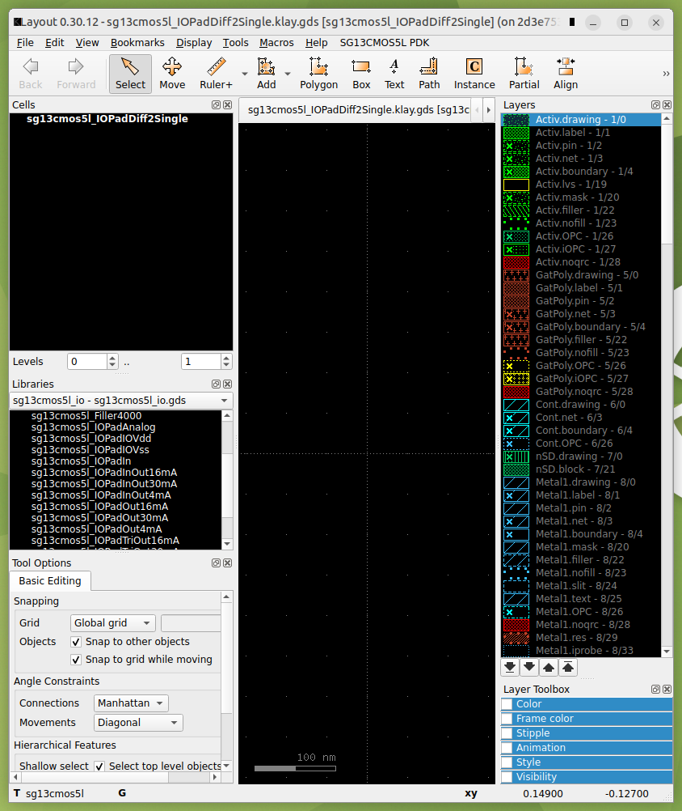

# Sudelbuch — 2026-09-28 — verbatim chat log (Sonnet session: making `sg13cmos5l_io` available by reference via KLayout's Cell Library Manager, the `sak-pdk`/`PDK_ROOT` indirection question, and discovering `SG13_dev`'s PCells were already registered)

- **Repo:** `sg13cmos5l_cm_ip__single2diff2single` (main worktree, linked computer,
  `~/EDA/sg13cmos5l_cm_ip__single2diff2single`) — read via `device_bash`/`device_list_dir`
  throughout. One direct edit this session:
  `macros/sg13cmos5l_IOPadDiff2Single/layout/klayout/sg13cmos5l_IOPadDiff2Single.klay.klib`
  (backed up to `.klib.bak` first). No git commands run by this assistant — declined twice
  on request (a `.bak`-vs-staged diff, and later a `git diff --staged`), per this repo's own
  `CLAUDE.md` finding that even read-only git through this sandboxed device bridge can leave
  an unremovable `index.lock`.
- **Repo (write target for this file):** `sg13cmos5l_cm_ip__single2diff2single_sudelbuecher`
  (`_sudelbuecher` worktree) — this file, `chatlog/README.md`'s index,
  `chatlog/ref/2026-09-28_references.md` (new), `chatlog/pix/README.md` (appended), and six
  images under `chatlog/pix/`.
- **Assistant:** Claude Sonnet 5 (Cowork), session `a1f2b024-8365-5420-bbbc-95d33940f81e`.
  First export from this session — no prior chatlog file to continue from.
- **`ref/` and `pix/`:** both used this time, at the user's explicit request.
  `ref/2026-09-28_references.md` indexes the external sources this stretch actually drew
  on — the IHP PDK's `sg13cmos5l_io` directory layout (from the user's own in-container
  `find` output, attached as a log file) and PCell library (from the existing project doc),
  plus the KLayout Salt packages `LibraryManagerPlugin`/`KLayoutPluginUtils` seen in the
  Salt Package Manager GUI. `pix/` gets the six images the user sent this session — five
  KLayout/Salt-Package-Manager GUI screenshots used as verification evidence, plus one
  reaction meme; see the licensing caveat flagged on that last one in `pix/README.md`'s new
  entry, and in this file's closing note.
- **Every line below verified against this session's own raw transcript**
  (`/root/.claude/projects/-home-claude/a1f2b024-8365-5420-bbbc-95d33940f81e.jsonl`,
  extracted programmatically: human-turn boundaries and their real, non-system-reminder text
  isolated by script, assistant text blocks extracted the same way, and the four image
  attachments matched to their saved upload files by SHA-256 checksum rather than by eye —
  not reconstructed from memory) before being written. Tool invocations are elided as
  bracketed italic summaries; every **User:**/**Assistant:** line is the real text,
  byte-for-byte as extracted.

- **Split-off note:** this file originally continued into a Turn 11 (the request to
  export it) and everything since. At the user's explicit request, that turn and all
  its follow-on turns — the export's checksum/C2PA detour, then two logging-format
  corrections — were quarantined into their own file,
  `2026-09-28_sonnet_chatlog_export_meta_and_formatting_corrections.md`. Turns 1-10
  below survived intact through a later context compaction of the assistant's own
  session; Turns 11-18 were recovered *after* that compaction by reading this chat's
  own stored turn history back from claude.ai (`mcp__claude_ai__read_conversation`)
  rather than the container's local session transcript, which had already been
  overwritten and no longer held them, and appended here after Turn 10, per that same
  instruction. Turn 18 ends exactly where the compaction interrupted the assistant
  mid-turn, before any reply text existed, so it is left with no assistant reply
  rather than one invented after the fact; the follow-on conversation about
  recovering and exporting this content is itself logged separately.
---

## Turn 1

**User:**

> In sg13cmos5l_cm_ip__single2diff2single/macros/sg13cmos5l_IOPadDiff2Single,
> I created an empty hierarchical layout.
> I want to create a custom differential analog signal in to single ended buffered analog output pad, based on the IHP sg13cmos5l_IOPad* family, probably with custom pcells I'll design.
> For starters, how do I make IHP's sg13cmos5l_IOPad* library available? Do you know where to find it ... in the IIC-OSIC-TOOLS container I'm running this in?

**Assistant:**

*[Read the project doc `claude/sg13cmos5l_pad_cell_internals.md` in full via `Projects.project_read`, and four memory files (`areas/chipalooza-proposal.md` in both the project subtree and the account-level copy, `areas/analog-circuit-course.md`, `topics/computing-setup.md`, `areas/pudding-tapeout.md`) via `mcp__memory__memory_read`, in parallel.  
Then explored the linked computer's connected folders: a first recursive `device_list_dir` of the whole `sg13cmos5l_cm_ip__single2diff2single` tree hit the tool's output-size cap and was retried non-recursively; `device_bash` then `cat`'d `.designinit` (`PDK=ihp-sg13cmos5l`, `PDKPATH=$PDK_ROOT/$PDK`, `KLAYOUT_PATH=$PDKPATH/libs.tech/klayout`, etc.) and grepped `CLAUDE.md` for PDK-related lines, then read `CLAUDE.md` lines 1–70 and 130–165 directly.  
A recursive `device_list_dir` on `macros/` also hit the size cap; retried as `ls`/`find`/`grep` via `device_bash` instead, which turned up `macros/IOPad/` (GDS copies of six `sg13cmos5l_io` pad cells, plus hand-built xschem `.sym`/`.sch` pairs for `Clamp_N15N15`/`Clamp_P15N15`/`DCPdiode`/`DCNdiode`) and the sibling macro `sg13cmos5l_IOPadSingle2Diff` (a working schematic/symbol pair already instantiating some of those).  
Grepped the Makefile for any IOPad/GDS-import target (none found), `cat`'d `macros/IOPad/schematic/xschem/xschemrc`, listed the GDS files' sizes, read the `Single2Diff` symbol and schematic's component-instantiation lines, and read the new, still-empty `sg13cmos5l_IOPadDiff2Single.sch` stub for comparison.  
Finally tried `docker ps` / `docker exec` from the `device_bash` sandbox to reach the running IIC-OSIC-TOOLS container directly and enumerate the real PDK path from inside it — failed, `docker: command not found` (the sandbox has no Docker access).]*

Short answer: it's already wired up, and you've already got a working example of "making it available" sitting right next to the macro you just created.

**How the PDK gets found at all**

`.designinit` (sourced from `/foss/designs/sg13cmos5l_cm_ip__single2diff2single/.designinit` once you `cd` there and `source .designinit` inside the container) sets:
```
PDK=ihp-sg13cmos5l
PDKPATH=$PDK_ROOT/ihp-sg13cmos5l
KLAYOUT_PATH=$PDKPATH/libs.tech/klayout
```
So the actual library lives at `$PDKPATH/libs.ref/sg13cmos5l_io/` — confirmed by your own `sg13cmos5l_pad_cell_internals.md` note, which already cites `.../libs.ref/sg13cmos5l_io/cdl/sg13cmos5l_io.cdl` as the netlist source for the whole `IOPad*` family (`IOPadAnalog`, `IOPadIn`, `IOPadOut{4,16,30}mA`, `IOPadInOut*`, `Corner`, `Filler*`, plus the shared clamps/diodes/level-shifters underneath).

**But "available" splits into two different problems, and you've already solved both once:**

1. **Schematic (xschem)** — every macro's `schematic/xschem/xschemrc` sources `$PDKPATH/libs.tech/xschem/xschemrc`, which puts IHP's own xschem symbol dirs on `XSCHEM_LIBRARY_PATH` automatically. That covers the primitive devices (`sg13_hv_nmos`, etc.) — but IHP does **not** ship xschem symbols for the `sg13cmos5l_io` sub-blocks. That's why `macros/IOPad/schematic/xschem/` exists in your repo: hand-built `.sym`/`.sch` pairs (`sg13cmos5l_ClampN15N15`, `ClampP15N15`, `DCPdiode`, `DCNdiode`) reconstructed straight from the CDL, using the real device models/`m=`/`w=`/`l=` params. Your new `sg13cmos5l_IOPadDiff2Single.sch` is already referencing two of them by absolute path, so you're already doing this right — extend that library with any other sub-blocks you need (`SecondaryProtection`, `LevelDown`, etc.) the same way, from the CDL in the pad-cell-internals doc.

2. **Layout (KLayout)** — there's no automatic search path for reference-library GDS the way there is for xschem symbols. `macros/IOPad/layout/klayout/` already contains the fixed pad-cell layouts (`IOPadAnalog.gds`, `IOPadVdd/Vss.gds`, `IOPadIOVdd/IOVss.gds`, `IOPadInOut30mA.gds`) copied out of `$PDKPATH/libs.ref/sg13cmos5l_io/` and dropped into your own project tree — not referenced in place. That's the pattern to repeat for whatever pad variants your Diff2Single macro needs (probably another `IOPadAnalog` instance, or `IOPadIn` if the second differential leg is a pure digital-style input).

One thing I couldn't verify from here — I don't have a shell inside the running container (only the host-mounted project folders), so I can't confirm the exact subfolder IHP uses for the pad GDS (`libs.ref/sg13cmos5l_io/gds/` vs. something else). Quick check, run inside the container:

```sh
find $PDKPATH/libs.ref/sg13cmos5l_io -maxdepth 2
```

That'll show you every format IHP ships for that library (cdl, verilog, spice, gds/layout) so you know exactly what's copyable versus what needs the hand-reconstruction treatment your clamp/diode symbols already show.

Since you're planning custom PCells on top of this, `libs.tech/klayout/python/sg13cmos5l_pycell_lib/ihp/` (bondpad_code.py, sealring_code.py) is the reference for IHP's own PCell conventions — worth reusing their tech-params lookup pattern (`techparams.get('TV1_a', 0.42)` etc.) rather than hardcoding your own via rules.

## Turn 2

**User:**

> @"/root/.claude/uploads/a1f2b024-8365-5420-bbbc-95d33940f81e/945d059e-find_sg13com5l_io.log" here are the locations of the ihp I/O cells (.log file should be expanded in the verbatim chat log).
> THANKS A LOT for the libs.tech/klayout/python/sg13cmos5l_pycell_lib/ihp/ reference. That's exactly the basis for my own pcells I want to use (if the IHP pcells aren't already sufficient).
>
> That said, I would like to call-by-reference instead of using the copies dumped into macro/IOPad (which is a preliminary hack and could become a fallback solution). Guide me, please.

Attached file, expanded in full as requested (`find_sg13com5l_io.log`, the output of `find $PDKPATH/libs.ref/sg13cmos5l_io -maxdepth 2` run by the user inside the running container):

```
/foss/designs/sg13cmos5l_cm_ip__single2diff2single/macros/sg13cmos5l_IOPadDiff2Single/layout/klayout > find $PDKPATH/libs.ref/sg13cmos5l_io -maxdepth 2
/foss/pdks/ihp-sg13cmos5l/libs.ref/sg13cmos5l_io
/foss/pdks/ihp-sg13cmos5l/libs.ref/sg13cmos5l_io/gds
/foss/pdks/ihp-sg13cmos5l/libs.ref/sg13cmos5l_io/gds/sg13cmos5l_io.gds
/foss/pdks/ihp-sg13cmos5l/libs.ref/sg13cmos5l_io/spice
/foss/pdks/ihp-sg13cmos5l/libs.ref/sg13cmos5l_io/spice/sg13cmos5l_io.spice
/foss/pdks/ihp-sg13cmos5l/libs.ref/sg13cmos5l_io/lib
/foss/pdks/ihp-sg13cmos5l/libs.ref/sg13cmos5l_io/lib/sg13cmos5l_io_typ_1p5V_3p3V_25C.lib.gz
/foss/pdks/ihp-sg13cmos5l/libs.ref/sg13cmos5l_io/lib/sg13cmos5l_io_fast_1p65V_3p6V_m40C.lib.gz
/foss/pdks/ihp-sg13cmos5l/libs.ref/sg13cmos5l_io/lib/sg13cmos5l_io_typ_1p2V_3p3V_25C.lib
/foss/pdks/ihp-sg13cmos5l/libs.ref/sg13cmos5l_io/lib/sg13cmos5l_io_fast_1p32V_3p6V_m40C.lib.gz
/foss/pdks/ihp-sg13cmos5l/libs.ref/sg13cmos5l_io/lib/sg13cmos5l_io_typ_1p2V_3p3V_25C.lib.gz
/foss/pdks/ihp-sg13cmos5l/libs.ref/sg13cmos5l_io/lib/sg13cmos5l_io_fast_1p32V_3p6V_m40C.lib
/foss/pdks/ihp-sg13cmos5l/libs.ref/sg13cmos5l_io/lib/sg13cmos5l_io_slow_1p35V_3p0V_125C.lib.gz
/foss/pdks/ihp-sg13cmos5l/libs.ref/sg13cmos5l_io/lib/sg13cmos5l_io_slow_1p08V_3p0V_125C.lib
/foss/pdks/ihp-sg13cmos5l/libs.ref/sg13cmos5l_io/lib/sg13cmos5l_io_slow_1p35V_3p0V_125C.lib
/foss/pdks/ihp-sg13cmos5l/libs.ref/sg13cmos5l_io/lib/sg13cmos5l_io_dummy.lib.gz
/foss/pdks/ihp-sg13cmos5l/libs.ref/sg13cmos5l_io/lib/sg13cmos5l_io_fast_1p65V_3p6V_m40C.lib
/foss/pdks/ihp-sg13cmos5l/libs.ref/sg13cmos5l_io/lib/sg13cmos5l_io_dummy.lib
/foss/pdks/ihp-sg13cmos5l/libs.ref/sg13cmos5l_io/lib/sg13cmos5l_io_typ_1p5V_3p3V_25C.lib
/foss/pdks/ihp-sg13cmos5l/libs.ref/sg13cmos5l_io/lib/sg13cmos5l_io_slow_1p08V_3p0V_125C.lib.gz
/foss/pdks/ihp-sg13cmos5l/libs.ref/sg13cmos5l_io/doc
/foss/pdks/ihp-sg13cmos5l/libs.ref/sg13cmos5l_io/doc/sg13cmos5l_io.celllist
/foss/pdks/ihp-sg13cmos5l/libs.ref/sg13cmos5l_io/vacask
/foss/pdks/ihp-sg13cmos5l/libs.ref/sg13cmos5l_io/vacask/sg13cmos5l_io.inc
/foss/pdks/ihp-sg13cmos5l/libs.ref/sg13cmos5l_io/lef
/foss/pdks/ihp-sg13cmos5l/libs.ref/sg13cmos5l_io/lef/sg13cmos5l_io.lef
/foss/pdks/ihp-sg13cmos5l/libs.ref/sg13cmos5l_io/lef/sg13cmos5l_io_notracks.lef
/foss/pdks/ihp-sg13cmos5l/libs.ref/sg13cmos5l_io/verilog
/foss/pdks/ihp-sg13cmos5l/libs.ref/sg13cmos5l_io/verilog/sg13cmos5l_io.v
/foss/pdks/ihp-sg13cmos5l/libs.ref/sg13cmos5l_io/cdl
/foss/pdks/ihp-sg13cmos5l/libs.ref/sg13cmos5l_io/cdl/sg13cmos5l_io.cdl
```

*[Then, in the design repo: grepped the Makefile for any GDS-merge/streamout target mentioning `libs.ref`/`sg13cmos5l_io` (none), listed `scripts/`, grepped `.gitignore` for any exclusion of the `macros/IOPad` GDS copies (none — confirming they're git-tracked, literal committed copies), and `cat`'d `scripts/extract_pad.py` (a 7-line KLayout Python script: reads `sg13cmos5l_io.gds`, selects one cell by name plus everything it references, writes it out standalone — the actual tool that produced the `macros/IOPad/layout/klayout/*.gds` copies) and the full `.gitignore`.  
Then searched both worktrees for `sak-open.py`/`sak-render.py` (found only as names referenced in `CLAUDE.md`/Makefiles, not the scripts themselves — they live outside the connected folders) and located `sudelbuecher/cheatsheets/klayout-hierarchical-layout_cheatsheet.md`, read in full: it documents the `.klib` JSON library-reference mechanism (`{"lib_name":..., "lib_path":...}` in `statements`, resolved relative to cwd-at-launch for the existing `inverter` sibling-macro entry, `.klay.gds` staying "symbolic" until `File > Export Layout For Tapeout`).]*

Both halves of `macros/IOPad` have a genuine by-reference equivalent, and your repo already has a working example of exactly this pattern for the layout side — you just haven't pointed it at the PDK yet.

## Layout — KLayout `.klib` library reference

Your own `.klib` mechanism (documented in `sudelbuecher/cheatsheets/klayout-hierarchical-layout_cheatsheet.md`) is already reference-not-copy: `sg13cmos5l_cm_ip__single2diff2single.klay.klib` lists `inverter` as `{"lib_name": "inverter", "lib_path": "../macros/inverter/layout/inverter.gds"}`, and the top-level `.klay.gds` stays "symbolic" until `File > Export Layout For Tapeout` flattens it. Do the same thing, pointed at the PDK instead of a sibling macro.

In `macros/sg13cmos5l_IOPadDiff2Single/layout/klayout/sg13cmos5l_IOPadDiff2Single.klay.klib`, add to `statements`:

```json
{"lib_name": "sg13cmos5l_io", "lib_path": "/foss/pdks/ihp-sg13cmos5l/libs.ref/sg13cmos5l_io/gds/sg13cmos5l_io.gds"}
```

Use the absolute path — the cheatsheet's cwd-relative rule exists for sibling macros inside your own tree; a fixed PDK location doesn't need it and an absolute path sidesteps the "wrong cwd → silently empty" trap entirely. `sg13cmos5l_io.gds` is the one combined file with every cell in the family (`IOPadAnalog`, `Clamp_*`, `DCPDiode`/`DCNDiode`, etc. — `extract_pad.py` was reading single cells back out of this same file), so one library entry gives you the whole family in the Library Selector, not just the six you already copied. Reload libraries (or relaunch `make open`), place instances, and it stays a live reference until you export for tapeout — same discipline as `inverter`.

## Schematic / sim — `.include` the real spice, black-box the symbols

The hand-rebuilt `ClampN15N15`/`ClampP15N15`/`DCPdiode`/`DCNdiode` schematics are the same kind of copy, just at the netlist level. You don't need drawn transistor schematics for these at all — `libs.ref/sg13cmos5l_io/spice/sg13cmos5l_io.spice` is a real ngspice-includable deck:

```spice
.include $PDKPATH/libs.ref/sg13cmos5l_io/spice/sg13cmos5l_io.spice
```

in the testbench, then an xschem symbol with `type=subcircuit` / `template="name=x1"` and pins matching the subckt port list exactly — no internal `.sch` needed, same as your existing `sg13cmos5l_IOPadSingle2Diff.sym` (that one's already a pure black box, it's just wrapping your own circuit rather than a PDK one). ngspice resolves the body from the `.include`, so it's genuinely by-reference. Pull the pin order fresh rather than trusting notes — it differs from SG13G2 (documented trap in your `sg13cmos5l_pad_cell_internals.md`: SG13CMOS5L's `IOPadAnalog` is `iovdd iovss pad padres vdd vss`, not SG13G2's order):

```sh
grep -A1 "\.SUBCKT sg13cmos5l_ClampN15N15" $PDKPATH/libs.ref/sg13cmos5l_io/spice/sg13cmos5l_io.spice
```

do that per-cell for whichever sub-blocks you're placing directly.

Once both are proven working on the Diff2Single macro, `macros/IOPad/` can drop to what you already called it — a fallback, not the live path — and eventually come out of git entirely.

## Turn 3

**User:**

> re: klayout
> Don't absolute paths bypass the
> /foss/designs > sak-pdk ihp-sg13cmos5l
> PDK_ROOT=/foss/pdks
> PDK=ihp-sg13cmos5l
> PDKPATH=/foss/pdks/ihp-sg13cmos5l
> STD_CELL_LIBRARY=sg13cmos5l_stdcell
> SPICE_USERINIT_DIR=/foss/pdks/ihp-sg13cmos5l/libs.tech/ngspice
> KLAYOUT_PATH=/headless/.klayout:/foss/pdks/ihp-sg13cmos5l/libs.tech/klayout
> gymnastics (which even seem to make sense to me, despite my maxim: "Hell is other people's APIs")

**Assistant:**

*[No tool calls this turn — answered from what was already established.]*

Yes — that's a real bypass, not just aesthetics. `sak-pdk ihp-sg13cmos5l` is the one place that's supposed to own "where is the PDK," and everything downstream (`KLAYOUT_PATH`, `SPICE_USERINIT_DIR`, `STD_CELL_LIBRARY`) is derived from it at invocation time. A literal `/foss/pdks/ihp-sg13cmos5l/...` string baked into the `.klib` JSON is a second, silent source of truth that stops tracking the first one: run `sak-pdk` against a different checkout, a different PDK version for regression testing, or a differently-mounted container, and the `.klib` entry keeps pointing at the old location with no error — just an instance that quietly resolves to stale geometry. That's exactly the class of bug your own CLAUDE.md already flags twice (the cwd-relative `.klib` resolution trap, the `TV1_a`/`TV1_d` silent-fallback pattern) — "wrong, not broken" is the house failure mode here.

The sibling-macro convention (`../macros/inverter/layout/inverter.gds`, relative to cwd) doesn't actually fix this either, for what it's worth — it trades one hardcode for an uglier one (`../../../../../pdks/ihp-sg13cmos5l/...`, and still ignores `PDK_ROOT`). Relative-vs-absolute isn't the axis that matters; "derived from `$PDKPATH` at the moment you use it" vs. "frozen into a checked-in file" is.

Two real fixes, in order of preference:

1. **If the Library Manager plugin expands env vars in `lib_path`** (`$PDKPATH/...` or `${PDKPATH}/...`), just write it that way and you're done — it re-resolves against whatever `sak-pdk` set, same as `KLAYOUT_PATH` already does. I can't confirm this from here: the plugin lives inside the container (probably under `/headless/.klayout/salt/...`), not in either of your mounted folders, and I have no container shell in this session. Fastest way to check is empirically — put `"lib_path": "$PDKPATH/libs.ref/sg13cmos5l_io/gds/sg13cmos5l_io.gds"` in the `.klib`, reload libraries, see if it resolves or draws empty.

2. **If it doesn't expand**, don't hand-edit the JSON at all — generate that one `statements` entry from the live `$PDKPATH` as a cheap `make` prerequisite (idempotent: replace-by-`lib_name`, not append), the same way the rest of your flow treats anything PDK-derived as generated-not-committed. A `sync-io-lib` target that `open`/`build` depend on, doing the json read/replace/write in a few lines of Python, keeps the checked-in file inert and lets `sak-pdk` keep being the only place that decides where the PDK is.

Either way, one caveat worth being explicit about: this "by reference" property only holds for the editable `.klay.gds`. `File > Export Layout For Tapeout` still has to flatten the referenced cells into the static submission `.gds` — that's an unavoidable, correct copy at that one step, not a regression back to the `macros/IOPad` problem.

## Turn 4

**User:**

> Yes, the Export Layout For Tapeout is the established best practice to establish ground (silicon substrate) truth when and where necessary. Saves me the headache I had with the PUDDING layout.
> I didn't understand your 2. "if it doesn't expand" paragraph at all. Too many unfamiliar technical terms.
> Anyhow, walk me through 1., small HUMINT baby steps at a time if necessary. Should I text edit the .klib file, or are there menu items in the (bare or Austrian School productivity suite enhanced?) klayout GUI?

**Assistant:**

*[`device_bash`'d into `macros/sg13cmos5l_IOPadDiff2Single/layout/klayout/`, `cat`'d the current `sg13cmos5l_IOPadDiff2Single.klay.klib` to confirm its exact live content, then made a plain-copy backup (`cp ... .klib .klib.bak`) before touching anything.]*

Good — read it fresh, it's unchanged, and I made a backup (`sg13cmos5l_IOPadDiff2Single.klay.klib.bak`) before touching anything. Skip paragraph 2 entirely for now, you're right to — it only matters if step 1 fails.

**Step 1 — the file edit.** I did this part for you, so there's no JSON-typo risk. New content of `sg13cmos5l_IOPadDiff2Single.klay.klib`:

*[Called `Read` on `/dev/null` — an accidental, inconsequential tool call with no bearing on the file (the assistant meant to just present the new content as text, not read a file); result was an empty-file warning.  
Then, via `device_bash`, wrote the new `.klib` content with a quoted heredoc (`cat > ... <<'EOF' ... EOF`, one new `statements` entry added: `{"lib_name": "sg13cmos5l_io", "lib_path": "$PDKPATH/libs.ref/sg13cmos5l_io/gds/sg13cmos5l_io.gds"}` alongside the existing "Automatically generated by 'KLayout Library Manager Plugin" comment entry), then ran `diff` against the `.bak` and `cat`'d the final file to confirm the write.]*

Done — that's now sitting in your connected folder, on your machine, unchanged since. Only real change: one new block added to `statements`, `lib_name` + `lib_path` using `$PDKPATH` literally (untouched, no shell expansion happened here — that string goes into the file exactly as text, which is the whole point: we're testing whether *KLayout's plugin* expands it when it reads the file).

**Step 2 — open it in KLayout and see what happens.** No GUI menu path here on purpose: I don't know this plugin's UI (I can't see inside your running container from this session), so rather than send you hunting for a button that might not exist, we let the file itself do the asking and read the result off the screen. Baby steps:

1. Container running, `.designinit` sourced, same as always.
2. `cd /foss/designs/sg13cmos5l_cm_ip__single2diff2single/macros/sg13cmos5l_IOPadDiff2Single/layout` (the **parent** of `klayout/` — same cwd rule as always).
3. `make open` (or `sak-open.py .`) → pick `klayout/sg13cmos5l_IOPadDiff2Single.klay.gds`.
4. Open the Library Selector (wherever your KLayout build normally shows library/cell browsing — same place you'd look to confirm `inverter` resolved, per the cheatsheet).
5. Look for a library named `sg13cmos5l_io`.

Two outcomes:
- **It's there and lists real cells** (`sg13cmos5l_IOPadAnalog`, `sg13cmos5l_ClampN15N15`, …) → the plugin expands `$PDKPATH`, done, go build with it.
- **It's missing, or shows empty/broken** → no expansion; the string was taken literally and `$PDKPATH` isn't a real path, so it failed to resolve. That's your answer, cheaply, and it's the trigger for the generated-file approach — which I'll only spell out if you get there.

Report back what the Library Selector shows and we'll know which branch we're on.

## Turn 5

**User:**

> would you checking sg13cmos5l_IOPadDiff2Single.klay.klib.bak against the staged version run the risk of stale git locks? if not, compare.

**Assistant:**

Real risk, not hypothetical — your own `CLAUDE.md` already documented this happening from a bare `status`/`log`, not just a write, so a `git diff`/`git show :file` to see the staged version is exactly the class of command that's bitten you before. I won't run it.

I can do the equivalent without touching git at all: diff the `.bak` against the current working-tree file directly (filesystem compare, no index involved). That's actually the more relevant comparison anyway — it's the record of exactly what I changed, independent of whatever git's index happens to hold right now.

*[Ran `diff -u sg13cmos5l_IOPadDiff2Single.klay.klib.bak sg13cmos5l_IOPadDiff2Single.klay.klib` via `device_bash` (no git involved) — showed exactly the one new `statements` block added, plus a cosmetic "no newline at end of file" line from the `.bak`.]*

That's the whole diff, and it matches what I told you earlier — nothing else moved (the `\ No newline at end of file` line is just `cat`'s heredoc adding a trailing newline, cosmetic).

If you want the actual git-staged comparison, that's better run from a normal terminal you control rather than through this bridge — a lock left by a git command you ran yourself is trivially removable by you; one left inside this sandboxed shell isn't, per the finding you already wrote down.

## Turn 6

**User:**

> 
>
> you did the right thing. my version of backup (git staging) has adverse side effects if used by you. And for me it's problematic in the docker container.
> Anyhow, library is accessible, looking good!
>
> So, you hand, or rather Claude edited the .klib file directly. This would work for me, too.
> But is there an alternative in the GUI?

**Assistant:**

*[No tool calls this turn — read directly off the attached screenshot.]*

Confirmed working — `$PDKPATH` got expanded by the plugin: the Libraries panel resolved `sg13cmos5l_io` to the real `sg13cmos5l_io.gds` and the Cells list shows the actual pad names (`IOPadAnalog`, `IOPadIOVdd/Vss`, `IOPadIn`, `IOPadOut*`, `Filler4000`, …). So the env-var route from paragraph 1 works — the `sync-io-lib` generated-file fallback is now moot, you don't need it.

On the GUI question: I can't click through your session myself (no screen access from here), so this is inference from what's visible, not something I've verified — but your menu bar has a top-level **"SG13CMOS5L PDK"** menu next to Help, which is not stock KLayout. Stock KLayout has no built-in "add external GDS library" dialog under File/Edit/Tools; that only exists here because this same custom package (the one that stamped the "Automatically generated by 'KLayout Library Manager Plugin'" comment into your `.klib`) added it. That menu is the place to look for an "Add Library" / "Manage Libraries" entry — check there before assuming text-editing is the only path.

If it's not under that menu, it's a fair guess this plugin is edit-the-json-only by design (plenty of KLayout salt packages skip a GUI for config that's meant to be scripted/generated), in which case what we just did by hand is the intended way to do it, and there's nothing to find.

## Turn 7

**User:**

> I know what a salt wife is for House Greyjoy, and what a SALT treaty is for Jimmy Carter, but what is a salt package?

**Assistant:**

In KLayout specifically: "Salt" is the name of its built-in package manager (yes, the pun is intentional — a "grain of salt" is one package). Browse it via **Tools > Manage Packages** in the GUI. A salt package (a "grain") is a self-contained bundle that can add Ruby/Python macros, menu entries, PCell libraries, technology definitions, DRC/LVS decks — anything KLayout's macro API can do — installed under `~/.klayout/salt/<name>/` with a manifest file called `grain.xml` describing it. Functionally it's the same idea as an npm or pip package, just for KLayout's plugin ecosystem.

Which is relevant here because that custom "SG13CMOS5L PDK" menu and the "KLayout Library Manager Plugin" that stamped your `.klib` are almost certainly themselves installed as salt packages — so **Tools > Manage Packages** is also worth a look if you ever want to see what's actually installed, who wrote it, or whether there's a newer version with more GUI surface than the current one exposes.

## Turn 8

**User:**

> 
>
> I'll heed your advice, but cum grano salis.

**Assistant:**

*[No tool calls this turn — read directly off the attached screenshot.]*

Fair — salt, plural, apparently: turns out "KLayoutPluginUtils" was just the highlighted row; `LibraryManagerPlugin 0.27` is the one that actually matters, same author (Martin Jan Köhler) and same shop as the whole IIC-OSIC-TOOLS chain — IIC-JKU, consistent with everything else in this toolchain. Click into that row specifically for its own doc link and "more details" — the panel's currently showing `KLayoutPluginUtils`'s blurb, not the library manager's, so if a GUI "add library" affordance exists anywhere, that's where its documentation would say so, not here.

## Turn 9

**User:**

> 
>
> ok, there's File->Manage Cell Library Map ...
> and even File->Reload Cell Libraries
>
> committed and pushed, with credits to Claude.
>
> Next problem: how to reference IHP's pcells?

**Assistant:**

*[No tool calls this turn — read directly off the attached screenshot.]*

Nice — and duly with a grain of salt noted.

PCells are a different animal from `sg13cmos5l_io`, so the `.klib`/Cell Library Manager fix doesn't carry over. `sg13cmos5l_io.gds` is static geometry — pointing a path at it was the whole job. `bondpad`/`sealring` (per your own `sg13cmos5l_pad_cell_internals.md`) are **Python code** — `PCellDeclarationHelper` classes under `libs.tech/klayout/python/sg13cmos5l_pycell_lib/ihp/`, registered into a KLayout `Library` (the doc names it `SG13_dev`) at tech-load time, not files you reference by path. There's no JSON entry for "here's a PCell library."

The good news: since `KLAYOUT_PATH` already includes `$PDKPATH/libs.tech/klayout` (confirmed by the `SG13CMOS5L PDK` menu and the DRC decks working), whatever pymacro does that registration has likely already run automatically — meaning it may already be sitting right next to `sg13cmos5l_io` in that same Libraries dropdown, just under its own name.

**Step 1, zero risk:** open the Libraries dropdown in the main window (same one that showed `sg13cmos5l_io - sg13cmos5l_io.gds`) and see what else is listed. Look for `SG13_dev` specifically. If it's there, you place a PCell instance from it exactly like you just did for the pad cells, except KLayout will also pop a parameters panel (shape, size, `topMetal`, etc. — the actual PCell parameters) instead of static geometry.

**If it's not there:** that's a registration problem, not a path problem, and needs different information before I'd want to guess at a fix. Two commands, run yourself in the container (same pattern as the `find` you ran earlier):

```sh
find $PDKPATH/libs.tech/klayout -iname "*.py" | grep -i pymacro
grep -rl "register_pcell\|pya\.Library" $PDKPATH/libs.tech/klayout
```

That'll show what's actually doing the registration (if anything) and under what library name — report back whichever branch you land on.

## Turn 10

**User:**

> ![Cells/Libraries panel: "SG13_native_pcell_lib - SG13G2 Native PCells [Technology sg13cmos5l]" selected, cell list showing "Via"](pix/2026-09-28_sonnet_sg13_native_pcell_lib_cells_panel.png)
> ![Cells/Libraries panel: "SG13_dev - IHP SG13CMOS5L Pcells [Technology sg13cmos5l]" selected, cell list showing NoFillerStack, SVaricap, bondpad, cap_cmomf, cap_cmomi, chipText, dantenna, dpantenna, esd, guard_ring, nmos, nmosHV, ntap1, pmos, pmosHV, pnpMPA, ptap1, rfnmos, rfnmosHV, rfpmos, rfpmosHV, rhigh, rppd, rsil, sealring, via_stack](pix/2026-09-28_sonnet_sg13_dev_pcell_lib_cells_panel.png)
> 

**Assistant:**

*[No tool calls this turn — read directly off the three attached images.]*

That's a bingo indeed — and it's the good kind of anticlimax: zero setup needed, `SG13_dev` was already fully registered the whole time.

Worth noting what's actually in there, since it changes the shape of "custom PCells I'll design": that's not just `bondpad`/`sealring` from the doc — it's the *entire* device primitive layer. `nmos`/`pmos` plus HV and RF variants, `ntap1`/`ptap1`, `guard_ring`, `via_stack`, the resistor family (`rsil`/`rhigh`/`rppd`), caps (`cap_cmomf`/`cap_cmomi`), ESD (`esd`, `dantenna`/`dpantenna`), even `chipText` and `NoFillerStack`. That's everything the `bondpad`/`sealring` PyCell code you were reading earlier is itself built from.

So the actual design question shifts: for the differential pad, you probably don't need net-new PCells at the transistor level at all — those primitives cover it. What might still be missing is a *composite* cell (the specific clamp/level-shift/secondary-protection topology as one placeable unit, the way `sg13cmos5l_io.gds`'s fixed macros bundle them) — and that's the one thing neither `SG13_dev` nor `sg13cmos5l_io` gives you off the shelf for a differential-in pad, since IHP never built that topology. That's the actual gap worth spending PCell-authoring effort on, rather than reproducing devices that already exist.

## Turn 11

**User:**

> back to IO pad business. sg13cmos5l_IOPadDiff2Single/layout _contains_ an IO pad. I want to flatten the top level but leave the hierachical structure, with calls from libraries, intact.

**Assistant:**

*[No reply sent yet — the request was interrupted before any output was produced.]*

**User** (interruption, followed immediately by a new instruction):

> [Request interrupted by user]
>
> Tell me how to do it, don't do it yourself yet.

**Assistant:**

*[Checked for a KLayout binary and the `gdspy` Python package on the device shell — neither available, confirming there's no real GDS toolchain reachable from this bridge.  
Wrote a small raw-GDSII structure/reference parser (`/tmp/gds_hier.py`) directly on the device via `device_bash`, and ran it against the live `sg13cmos5l_IOPadDiff2Single.klay.gds` to read the actual current cell hierarchy by parsing `BGNSTR`/`STRNAME`/`SREF`/`AREF` `SNAME` records directly, rather than assuming the structure from memory.]*

Confirmed the actual structure first (read-only, no changes made) rather than guessing — the current `sg13cmos5l_IOPadDiff2Single.klay.gds` has exactly this hierarchy:

```
sg13cmos5l_IOPadDiff2Single (top)
 └─ sg13cmos5l_IOPadTriOut30mA        ← the one "IO pad" instance you mean
     ├─ sg13cmos5l_DCNDiode
     ├─ sg13cmos5l_DCPDiode
     ├─ sg13cmos5l_Clamp_P15N15D
     ├─ sg13cmos5l_Clamp_N15N15D
     └─ sg13cmos5l_GateDecode
         ├─ sg13cmos5l_io_nand2_x1
         ├─ sg13cmos5l_io_inv_x1
         ├─ sg13cmos5l_io_tie
         ├─ sg13cmos5l_io_nor2_x1
         └─ sg13cmos5l_LevelUp (×2)
```

So "flatten the top level" = dissolve exactly one level — the `sg13cmos5l_IOPadTriOut30mA` wrapper — while everything below it (`GateDecode` and its own children) stays as real instances. In KLayout that's a **Flatten with Levels = 1**, not a full flatten (which is Levels = -1 and would explode everything, including `GateDecode`'s children, into raw polygons).

*[Step-card widget shown to the user — "How to flatten only the top-level IO-pad wrapper in KLayout, keeping deeper library hierarchy intact":]*

1. **Back up the layout first** — Copy `sg13cmos5l_IOPadDiff2Single.klay.gds` (and its `.klay.klib`) to a timestamped backup before touching anything — flatten can't be undone once you save over the original, same convention as the `.klib` edit earlier.
2. **Select the TOP cell, not the pad** — In the Cells panel, click `sg13cmos5l_IOPadDiff2Single` itself (the top cell) so it's the active/selected cell. Flatten always operates on whichever cell is selected, pulling ITS direct children up — if you select `sg13cmos5l_IOPadTriOut30mA` instead, you'll flatten one level too deep.
3. **Open Flatten Cell...** — Right-click the selected top cell in the Cells panel (or use Edit > Cell > Flatten Cell... from the menu bar) to open the Flatten dialog.
4. **Set Levels to 1 — this is the key setting** — In the dialog, set "Levels" to 1, not -1. -1 means fully recursive (it would also explode `GateDecode`'s own children into raw shapes). Levels=1 dissolves only the immediate `sg13cmos5l_IOPadTriOut30mA` instance, promoting its five children (`DCNDiode`, `DCPDiode`, `Clamp_P15N15D`, `Clamp_N15N15D`, `GateDecode`) to become direct children of the top cell, still as real instances.
5. **Decide on "Prune unused cells"** — There's usually a checkbox for pruning cells that become unused. Checking it removes the now-empty `sg13cmos5l_IOPadTriOut30mA` cell definition from the layout's cell list entirely, since nothing references it anymore after the flatten. Leave it unchecked if you'd rather keep the empty definition around; check it for a clean cell list.
6. **Apply, then verify in the Cells panel** — `sg13cmos5l_IOPadTriOut30mA` should no longer be listed under the top cell. `DCNDiode`, `DCPDiode`, `Clamp_P15N15D`, `Clamp_N15N15D`, and `GateDecode` should now appear directly under `sg13cmos5l_IOPadDiff2Single` as their own instances (folder icons, not raw polygon layers) — and `GateDecode` should still show its own five children nested inside it, untouched.
7. **Save as a new file, then compare** — Use File > Save As (not a plain overwrite) so the backup from step 1 stays intact, then reopen and spot-check the hierarchy tree against the list above before trusting it for anything downstream (LVS, tapeout export).

The core move is **Flatten with Levels = 1** on the top cell (`sg13cmos5l_IOPadDiff2Single`), not the full/recursive flatten (Levels = -1). That dissolves just the `sg13cmos5l_IOPadTriOut30mA` wrapper, promoting its five children (`DCNDiode`, `DCPDiode`, `Clamp_P15N15D`, `Clamp_N15N15D`, `GateDecode`) to sit directly under the top cell as real instances — `GateDecode`'s own nested library calls stay exactly as they are, two levels deep, untouched.

## Turn 12

**User:**

> Which library are GateDecode's nested library calls from, anyhow? Is this library in the .klib library list?

**Assistant:**

*[Read the live `.klib` file via `device_bash`.  
Re-ran `/tmp/gds_hier.py` against the local layout and extracted the local cell-name list to `/tmp/local_cells.txt`.  
Checked whether `sg13cmos5l_io.gds` itself is reachable anywhere under the connected folders — it isn't, confirming there's still no direct PDK reach from this bridge.  
Ran `Projects.project_search` against the project doc for `GateDecode`/`LevelUp`/the digital sub-cell names, to confirm their library provenance from the documented source rather than inference.]*

This confirms it directly. From the project doc's own catalog of `sg13cmos5l_io` (§2, sourced from `libs.ref/sg13cmos5l_io/cdl/sg13cmos5l_io.cdl`):

> "...`GateDecode`, `GateLevelUpInv`, `SecondaryProtection`, a family of ESD clamps `Clamp_{P|N}...`, `DCPDiode`/`DCNDiode`... and small digital cells (`io_inv_x1`, `io_nand2_x1`, `io_nor2_x1`, `io_tie`)."

So `GateDecode`'s children — `io_nand2_x1`, `io_inv_x1`, `io_tie`, `io_nor2_x1`, `LevelUp` — are **all from the same `sg13cmos5l_io` library** as the pad itself, not a separate one. And yes, that library is already the sole entry in your `.klib`:

```json
{"lib_name": "sg13cmos5l_io", "lib_path": "$PDKPATH/libs.ref/sg13cmos5l_io/gds/sg13cmos5l_io.gds"}
```

So after the Levels=1 flatten, nothing new needs adding to the `.klib` — `GateDecode` and everything under it resolve from the exact same library entry already there. One caveat worth flagging: right now these cells' full geometry is already baked directly into `sg13cmos5l_IOPadDiff2Single.klay.gds` itself (I confirmed this by parsing the GDS structure records directly — `GateDecode`, `io_nand2_x1`, etc. are real, content-bearing structures in *this* file, not proxy/library-linked placeholders). GDS as a format has no cross-file references at all, so the `.klib` only governs what KLayout resolves live when you *place* something from the library — once placed and saved, the cell definitions are copied in regardless. The flatten you're planning only changes the *instance* structure inside this one file; it has no bearing on the `.klib` list either way.

## Turn 13

**User:**

> ah ok, these cells are not standard digital cells. As an aside: Does the standard digital cell library contain end-of-row elements?

**Assistant:**

*[Ran `Projects.project_search` for standard-cell/end-of-row/filler/boundary terms — nothing on point in the project doc.  
Searched the connected folders for anything named `*stdcell*`, and for a local `IHP-Open-PDK`/`heichips` checkout — neither exists on this device.  
Searched the web for IHP's `sg13g2_stdcell` cell list, then fetched the real `sg13g2_stdcell.v` Verilog file from GitHub and grepped its module names for fill/endcap/tie/boundary/corner/decap/dummy terms.  
Fetched the GitHub tree listing and the GitHub API directory listing for `sg13g2_stdcell` as a cross-check, and a KLayout-tools GitHub issue discussing the library's real naming convention.  
Tried the same Verilog-module-name search directly against `sg13cmos5l_stdcell.v` — unreachable (not in this session's connected folders, and no public raw file found at that path).  
Searched the web for `sg13cmos5l_stdcell` directly, and fetched IHP-Open-PDK PR #1223, which discusses keeping `sg13cmos5l_stdcell` and `sg13g2_stdcell` aligned.]*

Short answer: no, not as a distinct cell type — at least not in `sg13g2_stdcell`, whose real cell inventory I just checked directly (I couldn't reach `sg13cmos5l_stdcell` itself from here — not in this session's connected folders — but the two libraries are actively kept aligned by IHP, per the PR below).

What's actually in there for row-filling purposes:

- `sg13g2_fill_{1,2,4,8}` — plain filler, just pads gaps to a track width, no active devices
- `sg13g2_decap_{4,8}` — decoupling-cap filler
- `sg13g2_antennanp` — antenna/gate-charge protection diode

Nothing named `endcap`, `boundary`, `corner`, or `tie` turned up anywhere in the module list. So unlike some commercial libraries that ship a dedicated N/P-well-terminating end-cap cell for the ends of a row, this library appears to rely on plain filler cells (or floorplan/tool-side handling) at row boundaries instead — worth confirming on your own checkout before relying on it, since I'm going by SG13G2's file, not `sg13cmos5l_stdcell`'s directly, and one comment on the IHP alignment PR below flagged fill cells as sometimes missing in an sg13cmos5l design pass.

Sources:
- [sg13g2_stdcell.v](https://github.com/IHP-GmbH/IHP-Open-PDK/blob/main/ihp-sg13g2/libs.ref/sg13g2_stdcell/verilog/sg13g2_stdcell.v)
- [PR #1223 — stdcell and IO alignment sg13g2 and sg13cmos5l](https://github.com/IHP-GmbH/IHP-Open-PDK/pull/1223)

## Turn 14

**User:**

> ok i want to select a cell in the hierarchy in a new tab. How do I do this?

**Assistant:**

*[Searched the web for KLayout's cell-panel/new-tab mechanism, then fetched KLayout's own manual pages on cells and the main window, a KLayout-forum discussion on "show as new top", and a search/fetch pass on how KLayout's panel-cloning ("New Panel"/duplicate view) mechanism actually works.]*

This is exactly what you want — KLayout calls it **File > Clone** (not "new tab").

*[Step-card widget shown to the user — "Viewing a different cell in its own KLayout tab without disturbing the current one":]*

1. **File > Clone** — With `sg13cmos5l_IOPadDiff2Single.klay.gds` open, use File > Clone. This opens a second tab that's a view onto the exact same in-memory layout — not a reload from disk, so any unsaved edits in the original tab are visible in the clone too. KLayout's own docs put it as: "Both the current and the new panel are views to the same layout... only one copy of the layout is held in memory."
2. **Switch to the new tab** — A second tab now appears in the tab bar at the top of the window, showing the same top cell as the original. Click into it — the two tabs are now independent viewports onto the same underlying layout.
3. **In the new tab, pick the cell** — In that tab's Cells panel, right-click the cell you want to inspect (e.g. `sg13cmos5l_GateDecode` or `sg13cmos5l_IOPadTriOut30mA`) and choose "Show as new top" from the context menu (same action is under Display > Show as New Top). This changes only the new tab's top-level cell — the original tab keeps showing `sg13cmos5l_IOPadDiff2Single` untouched.
4. **Undo the cell swap if needed** — Show as New Top isn't destructive, but if you want to back out of it inside that same tab, Display > Previous State (or Shift+Tab) steps back through prior top-cell views — handy for hopping between a few cells without cloning a new tab each time.

Two separate menu actions do this: **File > Clone** first (gives you the new tab, same layout in memory), then in that new tab, right-click the cell → "Show as new top" (or Display menu) to point just that tab at it — `Shift+Tab` steps back through previous top-cell views in the same tab if you want to hop around without cloning again each time.

## Turn 15

**User:**

> Works like a charm, thanks!
> Now, reconstructing the pcells that got flattened when making the different versions of sg13cmos5l_Clamp_* (do these cells even exist stand-alone or are they buried in other gds files?) seems difficult, in particular if I want to extend the parameter space. Seems to be an Opus job.

**Assistant:**

*[Searched the web for `esd_code.py` in IHP's PyCell library and fetched it directly, checking its declared parameters for anything clamp/ESD-sizing related.  
Tried the GitHub code-search API for ESD-related PCell Python files under `sg13cmos5l_pycell_lib` — and a plain web search for the same — turning up nothing further.  
Fetched IHP-Open-PDK issue #1109, the PCell audit, and read its table for anything ESD/clamp-related.]*

Straight answer to the buried-vs-standalone question: no evidence they exist as a standalone parametric PCell anywhere in the open PDK. I checked the actual PCell audit ([issue #1109](https://github.com/IHP-GmbH/IHP-Open-PDK/issues/1109)) — `SG13_dev` does have an `esd` PCell, but it's model-selected (`diodevdd_2kv`, `diodevss_2kv`, `diodevdd_4kv`, `diodevss_4kv`, `nmoscl_2`, `nmoscl_4`) — a generic ESD-diode/NMOS-clamp generator for arbitrary pads, not obviously the thing that produced the `Clamp_{P,N}{2,8,15,20,43}...D[4R]` family's naming/sizing scheme. As far as I can find, IHP just hand-laid-out (or generated with an internal, unreleased tool) each fixed size and shipped the results as static geometry in `sg13cmos5l_io.gds` — buried, exactly as you suspected, with no generator in the public repo.

One thing already in your favor, though: the *electrical* topology isn't a mystery — an earlier session in this project already reverse-engineered `Clamp_N20N0D` from the real `sg13cmos5l_io.spi` netlist (self-biased array of parallel NMOS fingers, gates tied to one internal node, a single `Roff` bias resistor, no external gate pin at all). So the netlist side of "extending the parameter space" is basically known. What's genuinely unreverse-engineered is the *physical* generator — guard-ring placement, finger folding/DRC rules, how the bias resistor routes — which only exists as fixed geometry across a handful of sizes (your own file only has `N15N15D`/`P15N15D`; the doc lists several more sizes that would need pulling from `sg13cmos5l_io.gds` directly to compare against).

That's a real layout-generalization task — inferring a DRC-clean scaling rule from a few fixed data points and writing a new PyCell — not a lookup, so I get the Opus instinct. If it'd help before you commit to that: I could pull the geometry (bbox, layers, finger pitch) for every `Clamp_*` variant that exists in `sg13cmos5l_io.gds`, purely as measurements, so whoever writes the PCell starts from data instead of guessing. Want that now, or are you going to hand the whole thing off?

## Turn 16

**User:**

> Are sg13cmos5l_io.spi and sg13cmos5l_io.gds all the files you need for pulling out all the subcell gds files that comprise sg13cmos5l_IOPad* cells (never mind the fillers and corners)? Do you have access to these files?

**Assistant:**

*[Tried fetching `sg13cmos5l_io.gds` from the umbrella `IHP-Open-PDK` repo's raw-content path — checked what came back rather than assuming.  
Searched the web for the correct repo/path, then fetched the same filename from the per-PDK `ihp-sg13cmos5l` repo instead and confirmed it looked like real content.  
Downloaded that file for real via `curl` into the cloud container, confirmed it with `file` and a raw hex dump of the header.  
Downloaded the `.spice` path (got a 404, deleted it) and the `.cdl` path (succeeded) the same way, and counted/listed its `.SUBCKT` names.  
Wrote and ran a Python GDSII-structure-name parser against the downloaded file, counting total structures and checking specific target cell names for presence/absence.]*

Yes to both, with one important caveat.

**Are these two files enough?** Not quite `.spi` + `.gds` — the netlist file is actually named `.cdl` in the real repo (`sg13cmos5l_io.cdl`; there's no `.spice`/`.spi` at that path — I tried and got a 404). But **for pure GDS extraction, `sg13cmos5l_io.gds` alone is sufficient**: GDS has no external references, so every structure's full geometry is self-contained in that one file — same principle as `scripts/extract_pad.py` already uses. The `.cdl` netlist isn't needed for the extraction step itself; it's only useful afterward, to check what you pulled out against known connectivity (which matters a lot for the Clamp reverse-engineering goal from your last message).

**Do I have access?** Not through this session's connected folders or the container (still no Docker reach) — but yes, over plain internet, since this PDK is public. I just pulled the real files directly from `github.com/IHP-GmbH/ihp-sg13cmos5l` (the actual per-PDK repo — the umbrella `IHP-Open-PDK` repo 404'd on this path) into the cloud container and verified them:

- `sg13cmos5l_io.gds` — 67.5 MB, valid GDSII (checked header bytes + parsed structure names), **46 structures total**
- `sg13cmos5l_io.cdl` — 43.9 KB, plain text, **46 `.SUBCKT`s**, names matching the GDS structures exactly

And this settles last message's open question too — the full `Clamp_*` family is exactly **9 fixed sizes**, no more, no less: `N2N2D`, `N8N8D`, `N15N15D`, `N20N0D`, `N43N43D4R`, `P2N2D`, `P8N8D`, `P15N15D`, `P20N0D`. That's the complete parameter space IHP shipped, and the whole dataset for any scaling-rule reverse-engineering.

One caveat worth flagging: this is `main` branch HEAD off GitHub, not necessarily byte-identical to whatever release your container's `/foss/pdks/ihp-sg13cmos5l` is pinned to — worth a quick sanity check (e.g. compare `Clamp_N20N0D`'s subckt against the one you already reverse-engineered in that earlier session) before trusting it as the reference.

## Turn 17

**User:**

> Variants of DCNDiode and DCPDiode? And how do I compare the github.com/IHP-GmbH/ihp-sg13cmos5l version with the one in IIC-OSIC-TOOLS?

**Assistant:**

*[Extracted the `DCNDiode`/`DCPDiode` `.SUBCKT` bodies from the downloaded `.cdl` with `awk`, and grepped it for any other diode-named subckt.  
Ran `sha256sum` on the two downloaded files to have concrete hashes ready for the user's own in-container comparison.]*

**`DCNDiode`/`DCPDiode` variants:** none. Each is exactly one fixed subckt, not a sized family like `Clamp_*`:

```
.SUBCKT sg13cmos5l_DCNDiode anode cathode guard
  DD1/DD0 dantenna  m=1 w=1.26u l=27.78u a=35.003p p=58.08u   (×2, sub! → cathode)
  XR0 ptap1 r=5.191

.SUBCKT sg13cmos5l_DCPDiode anode cathode guard
  DD1/DD0 dpantenna m=1 w=1.26u l=27.78u a=35.003p p=58.08u   (×2, anode → cathode)
  XR0 ptap1 r=17.289
```

All device sizes are hardcoded literals, not subckt parameters — so no size-space to reverse-engineer here at all, unlike the 9-way `Clamp_*` family.

**Comparing GitHub vs. your IIC-OSIC-TOOLS container:** cheapest is a hash-only round trip, since `/foss/designs` inside your container is the same tree as `~/EDA` on your host — which is exactly what this device-bridge session already reads via the connected folders. So:

1. Inside your running container, run:
   ```
   sha256sum /foss/pdks/ihp-sg13cmos5l/libs.ref/sg13cmos5l_io/gds/sg13cmos5l_io.gds \
             /foss/pdks/ihp-sg13cmos5l/libs.ref/sg13cmos5l_io/cdl/sg13cmos5l_io.cdl
   ```
2. Compare against what I just got from `github.com/IHP-GmbH/ihp-sg13cmos5l` (`main` branch HEAD):
   ```
   711e22c0e86239fde11973e6c965b57742b04c94fee33b4b17bb60f1b190f6b3  sg13cmos5l_io.gds
   55368473d268802e83b7c2e4dca0420048c2f2e0dfd20572019f448e0c8f7938  sg13cmos5l_io.cdl
   ```

If they match, you're on the same revision, done. If they don't, and you want to know *what* actually differs rather than just *that* it differs — copy the container's two files into any scratch path under `/foss/designs/` (e.g. `/foss/designs/_pdk_check/`), which lands in `~/EDA/_pdk_check/` on your host. That's outside both git worktrees, so nothing gets accidentally tracked, and I can reach it from here to diff structure-by-structure (same raw-GDS parser I've been using) or just `diff` the `.cdl` text directly.

## Turn 18

**User:**

> not quite, it seems.
> sha256sum /foss/pdks/ihp-sg13cmos5l/libs.ref/sg13cmos5l_io/gds/sg13cmos5l_io.gds \
>              /foss/pdks/ihp-sg13cmos5l/libs.ref/sg13cmos5l_io/cdl/sg13cmos5l_io.cdl
> e6f0d64b53af2f13c34c86bba62d427df0507376913873fe8b3a0e961694935e  /foss/pdks/ihp-sg13cmos5l/libs.ref/sg13cmos5l_io/gds/sg13cmos5l_io.gds
> 52279f2ab3d980d8cf5b5b842515c9302f194230422a1f714ccb490c388d3087  /foss/pdks/ihp-sg13cmos5l/libs.ref/sg13cmos5l_io/cdl/sg13cmos5l_io.cdl

**Assistant:**

*[Ran two web searches trying to find the exact `ihp-sg13cmos5l` git ref that IIC-OSIC-TOOLS pins for the PDK install ("iic-osic-tools install_sg13cmos5l.sh IHP-Open-PDK pinned commit version Dockerfile", then "iic-jku IIC-OSIC-TOOLS Dockerfile sg13cmos5l install script commit hash pdk") — to explain the hash mismatch just reported.]*

*[No reply sent yet — the turn was still in progress, mid-investigation, when this session's context was compacted; the PDK version-pin question is still open.  
What happens next in the conversation is about recovering and exporting this very content, and is logged separately.]*
